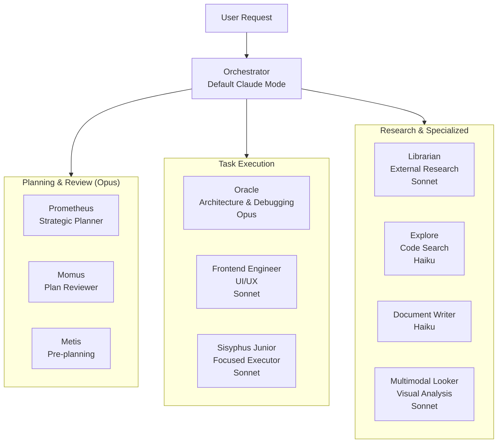
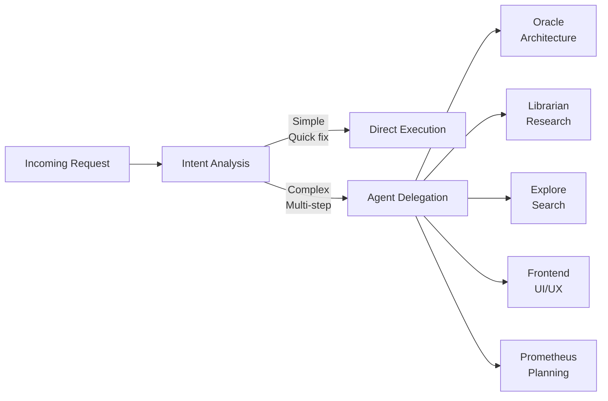
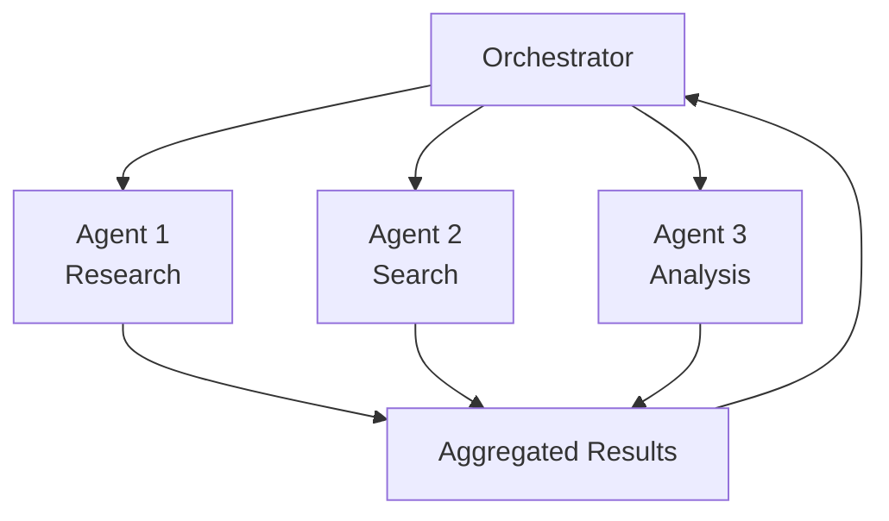

# Agent System

Multi-agent orchestration system for Claude Code with specialized subagents.

> **Like Sisyphus, these agents persist until every task is complete.**

## Overview

oh-my-claude-sisyphus provides a hierarchical orchestration model where specialized AI agents handle different aspects of development work. The system includes eleven specialized agents organized into three categories: Task Execution, Planning & Review, and Orchestration.



## Agent Categories

### Task Execution Agents

| Agent | Model | Purpose |
|-------|-------|---------|
| **Oracle** | Opus | Architecture decisions, debugging consultation, root cause analysis |
| **Librarian** | Sonnet | External documentation, OSS research, implementation examples |
| **Explore** | Haiku | Fast codebase search, pattern matching, file discovery |
| **Frontend Engineer** | Sonnet | Visual design, UI/UX implementation |
| **Document Writer** | Haiku | Technical documentation, prose generation |
| **Multimodal Looker** | Sonnet | Image/PDF analysis, visual content extraction |

### Planning & Review Agents

| Agent | Model | Purpose |
|-------|-------|---------|
| **Prometheus** | Opus | Strategic planning, comprehensive work plans, interview-style requirements |
| **Momus** | Opus | Critical plan review, feasibility assessment, risk identification |
| **Metis** | Opus | Pre-planning analysis, hidden requirement detection, ambiguity resolution |

### Orchestration Agents

| Agent | Model | Purpose |
|-------|-------|---------|
| **Sisyphus Junior** | Sonnet | Focused task execution, plan following, direct implementation |

## Orchestration Model

The default Claude Code session operates as the primary orchestrator, delegating work to specialized subagents based on task requirements.

### Delegation Patterns



### Parallel Execution

Independent agents execute concurrently for maximum efficiency:



## Smart Model Routing

Agents are assigned to model tiers based on task complexity:

| Domain | LOW (Haiku) | MEDIUM (Sonnet) | HIGH (Opus) |
|--------|-------------|-----------------|-------------|
| **Analysis** | oracle-low | oracle-medium | oracle |
| **Execution** | sisyphus-junior-low | sisyphus-junior | sisyphus-junior-high |
| **Search** | explore | explore-medium | - |
| **Research** | librarian-low | librarian | - |
| **Frontend** | frontend-engineer-low | frontend-engineer | frontend-engineer-high |

### Tier Selection Guide

| Task Complexity | Tier | Examples |
|-----------------|------|----------|
| Simple lookups | LOW | "What does this function return?", "Find where X is defined" |
| Standard work | MEDIUM | "Add error handling", "Implement this feature" |
| Complex analysis | HIGH | "Debug this race condition", "Refactor auth module" |

## Agent Invocation

### Automatic Delegation

The orchestrator automatically delegates to specialized agents based on task characteristics:

| Trigger Pattern | Agent |
|-----------------|-------|
| Architecture decisions, debugging | Oracle |
| External docs, OSS examples | Librarian |
| Code location questions | Explore |
| UI/UX, styling, components | Frontend Engineer |
| Documentation tasks | Document Writer |
| Image/screenshot analysis | Multimodal Looker |

### Manual Invocation

Explicitly request an agent by name:

```
Use the oracle agent to debug the memory leak
Have the librarian find all documentation about the API
Ask explore to find all TypeScript files that import React
```

## Continuation Enforcement

All agents follow the Sisyphus principle: **the boulder never stops**.

- Multi-step tasks create TODO lists
- Tasks are marked in_progress before starting
- Tasks are marked completed immediately after finishing
- Work continues until all todos are complete

## Configuration

Agents are configured through markdown files in `~/.claude/agents/`:

```yaml
---
name: agent-name
description: Agent description
model: opus  # or sonnet, haiku
---
System prompt content...
```

### Agent Customization

Edit agent files to customize behavior:

- Change the model tier
- Modify system prompts
- Adjust tool permissions
- Add domain-specific instructions

## See Also

- [Task Execution Agents](task-execution/) - Oracle, Librarian, Explore, Frontend Engineer, Document Writer, Multimodal Looker
- [Planning & Review Agents](planning-review/) - Prometheus, Momus, Metis
- [Orchestration Agents](orchestration/) - Sisyphus Junior
- [Skills System](/skills/) - Composable skill enhancements
