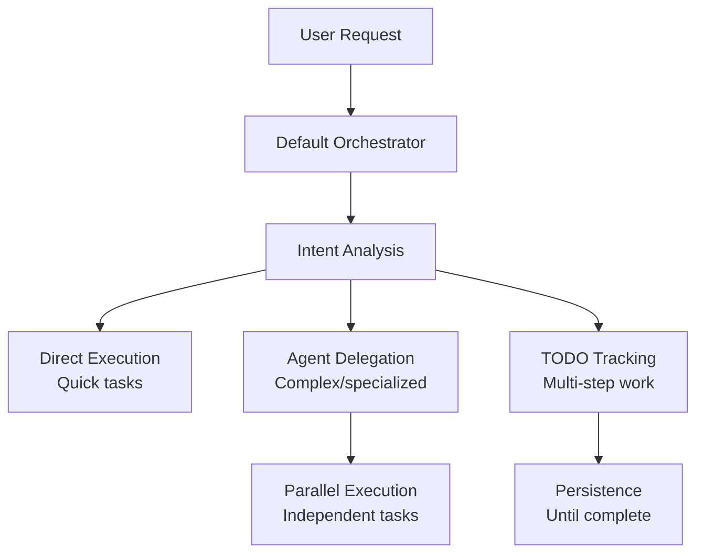
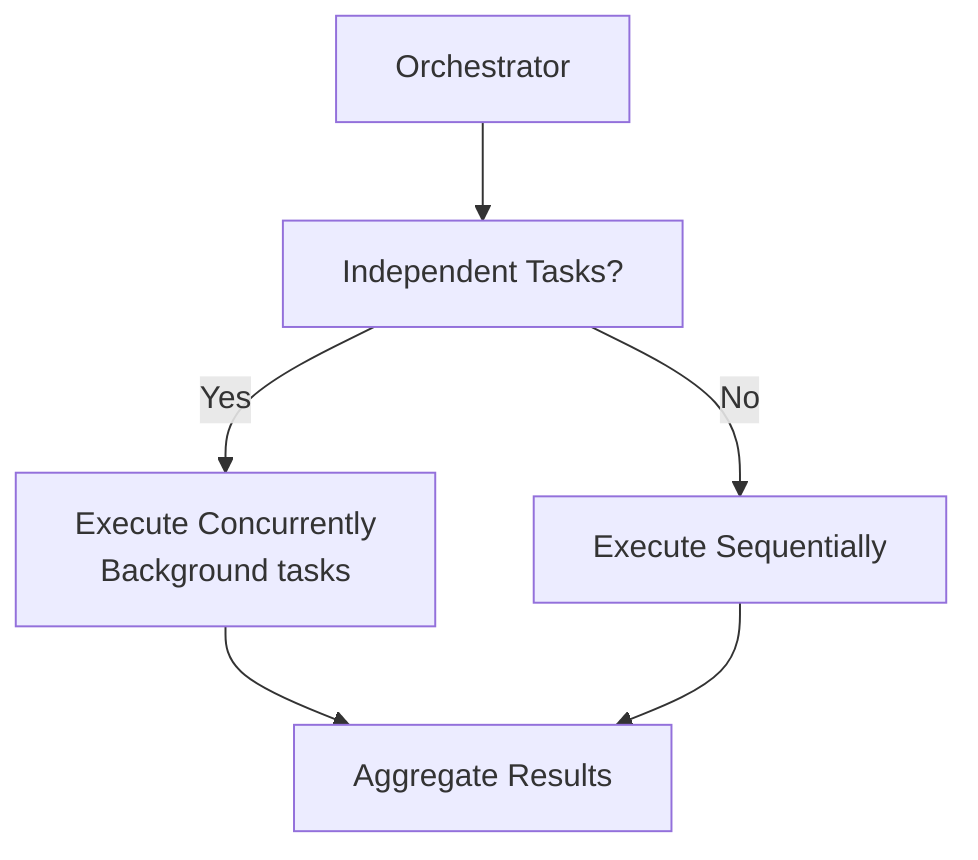
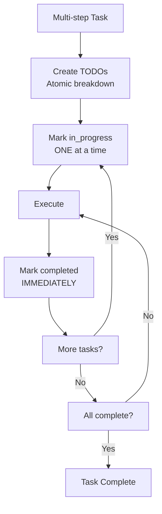

# Orchestrator

Master coordination for complex multi-step tasks with intelligent agent delegation.

---

## Overview

| Property | Value |
|----------|-------|
| **Name** | orchestrator |
| **Type** | Built-in command |
| **Primary Function** | Complex multi-step task coordination |

The Orchestrator is the default coordination mode in oh-my-claude-sisyphus. It manages agent delegation, parallel execution, and task tracking without requiring explicit activation.

> **This is now default behavior.** The Sisyphus orchestration mode is built into Claude Code's default operating mode.



---

## What's Built Into Default Mode

| Capability | Description |
|------------|-------------|
| **Smart Delegation** | Delegate complex/specialized work to subagents |
| **Parallel Execution** | Run independent tasks concurrently when profitable |
| **TODO Tracking** | Create and track todos for multi-step tasks |
| **Background Execution** | Long-running operations run async |
| **Persistence** | Continue until todo list is empty |

---

## Delegation Patterns

### When to Delegate

The orchestrator automatically delegates based on task characteristics:

| Trigger | Agent |
|---------|-------|
| Architecture decisions, debugging | [Oracle](../../task-execution/oracle.md) |
| External docs, OSS examples | [Librarian](../../task-execution/librarian.md) |
| Code location questions | [Explore](../../task-execution/explore.md) |
| UI/UX, styling, components | [Frontend Engineer](../../task-execution/frontend-engineer.md) |
| Documentation tasks | [Document Writer](../../task-execution/document-writer.md) |
| Image/screenshot analysis | [Multimodal Looker](../../task-execution/multimodal-looker.md) |
| Strategic planning needed | [Prometheus](../../planning-review/prometheus.md) |

### Manual Invocation

Explicitly request an agent:

```
Use the oracle agent to debug the memory leak
Have the librarian find all documentation about the API
Ask explore to find all TypeScript files that import React
```

---

## Parallel Execution

Independent agents execute concurrently for maximum efficiency:



### When to Use Parallel Execution

| Pattern | Action |
|---------|--------|
| **Independent research** | Launch explore + librarian simultaneously |
| **Multiple file searches** | Multiple grep/ast_grep calls |
| **Package installation + config** | Background install while editing config |

---

## Background Execution Rules

### Run in Background

Set `run_in_background: true` for:

| Operation Type | Examples |
|----------------|----------|
| **Package installation** | npm install, pip install, cargo build |
| **Build processes** | npm run build, make, tsc |
| **Test suites** | npm test, pytest, cargo test |
| **Docker operations** | docker build, docker pull |

### Run Blocking

Run in foreground for:

| Operation Type | Examples |
|----------------|----------|
| **Quick status checks** | git status, ls, pwd |
| **File reads** | Read operations |
| **File edits** | Edit operations |
| **Simple commands** | Quick executions |

---

## Smart Model Routing

Choose tier based on task complexity:

| Domain | LOW (Haiku) | MEDIUM (Sonnet) | HIGH (Opus) |
|--------|-------------|-----------------|-------------|
| **Analysis** | oracle-low | oracle-medium | oracle |
| **Execution** | sisyphus-junior-low | sisyphus-junior | sisyphus-junior-high |
| **Search** | explore | explore-medium | - |
| **Research** | librarian-low | librarian | - |
| **Frontend** | frontend-engineer-low | frontend-engineer | frontend-engineer-high |

### Tier Selection Guide

| Task Complexity | Tier | Examples |
|-----------------|------|----------|
| **Simple lookups** | LOW | "What does this function return?", "Find where X is defined" |
| **Standard work** | MEDIUM | "Add error handling", "Implement this feature" |
| **Complex analysis** | HIGH | "Debug this race condition", "Refactor auth module" |

---

## TODO Tracking

Multi-step tasks automatically create TODO lists:



---

## Persistence

**The boulder does not stop until it reaches the summit.**

| Principle | Action |
|-----------|--------|
| **TODO obsession** | Create todos for 2+ steps |
| **Mark immediately** | Complete status right after finishing |
| **Never batch** | One task in_progress at a time |
| **Verify completion** | All todos marked complete before stopping |

---

## When to Use /ultrawork Instead

Use `/ultrawork` when you want **maximum intensity**:

| Default Mode | Ultrawork Mode |
|--------------|----------------|
| Heuristic-based parallelism | **Parallel EVERYTHING** |
| Selective delegation | **Delegate even small tasks** |
| Some waiting for results | **Never wait** |
| Balanced efficiency | **Maximum throughput** |

---

## Quick Reference

| Task Pattern | Model |
|--------------|-------|
| "Where is X" / "Find X" | haiku |
| "How does X work" / "Add Y" | sonnet |
| "Debug X" / "Refactor X" | opus |

---

## See Also

- [Task Execution Agents](../../task-execution/) - Oracle, Librarian, Explore, Frontend Engineer, Document Writer, Multimodal Looker
- [Planning & Review Agents](../../planning-review/) - Prometheus, Momus, Metis
- [Ultrawork Skill](../../skills/ultrawork.md) - Maximum performance mode
