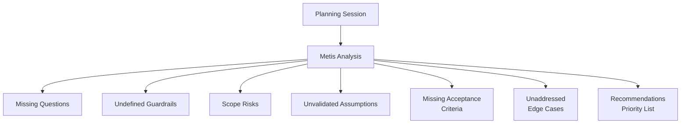

# Metis Agent

Pre-planning consultant for requirements analysis and hidden requirement detection.

> **Named after the Titan goddess of wisdom, cunning counsel, and deep thought.**

---

## Overview

| Property | Value |
|----------|-------|
| **Name** | metis |
| **Model** | Opus |
| **Mode** | subagent |
| **Primary Function** | Pre-planning analysis, hidden requirement detection, ambiguity resolution |

Metis analyzes requests BEFORE they become plans, catching what others miss. The agent examines planning sessions to identify questions that should have been asked, guardrails that need definition, scope creep areas, and unvalidated assumptions.



---

## What Metis Examines

| Category | What to Check |
|----------|---------------|
| **Requirements** | Are they complete? Testable? Unambiguous? |
| **Assumptions** | What's being assumed without validation? |
| **Scope** | What's included? What's explicitly excluded? |
| **Dependencies** | What must exist before work starts? |
| **Risks** | What could go wrong? How to mitigate? |
| **Success Criteria** | How do we know when it's done? |
| **Edge Cases** | What about unusual inputs/states? |

---

## Question Categories

### Functional Questions

| Question Type | Examples |
|---------------|----------|
| **Behavior** | What exactly should happen when X? |
| **Edge Cases** | What if the input is Y instead of X? |
| **Users** | Who is the user for this feature? |

### Technical Questions

| Question Type | Examples |
|---------------|----------|
| **Patterns** | What patterns should be followed? |
| **Error Handling** | What's the error handling strategy? |
| **Performance** | What are the performance requirements? |

### Scope Questions

| Question Type | Examples |
|---------------|----------|
| **Inclusions** | What's included in this work? |
| **Exclusions** | What's explicitly NOT included? |
| **MVP** | What's the minimum viable version? |

---

## Mandatory Response Structure

Every Metis response follows this format:

```markdown
## Metis Analysis: [Topic]

### Missing Questions
1. [Question that wasn't asked] - [Why it matters]
2. [Question that wasn't asked] - [Why it matters]

### Undefined Guardrails
1. [What needs explicit bounds] - [Suggested definition]
2. [What needs explicit bounds] - [Suggested definition]

### Scope Risks
1. [Area prone to scope creep] - [How to prevent]

### Unvalidated Assumptions
1. [Assumption being made] - [How to validate]

### Missing Acceptance Criteria
1. [What success looks like] - [Measurable criterion]

### Edge Cases
1. [Unusual scenario] - [How to handle]

### Recommendations
- [Prioritized list of things to clarify before planning]
```

---

## Analysis Categories in Detail

### Missing Questions

Identify questions that should have been asked during the planning interview:

| Example Missing Question | Why It Matters |
|-------------------------|----------------|
| "What happens if the API is down?" | Error handling strategy undefined |
| "Who can access this feature?" | Authorization not specified |
| "What's the expected load?" | Performance can't be verified |

### Undefined Guardrails

Identify boundaries that need explicit definition:

| Guardrail Type | Example |
|----------------|---------|
| **Performance** | "Response time < 200ms" |
| **Compatibility** | "Must work on Chrome, Firefox, Safari" |
| **Security** | "All inputs validated before processing" |

### Scope Risks

Identify areas where scope creep is likely:

| Risk Area | Prevention Strategy |
|-----------|---------------------|
| **Feature additions** | Explicitly exclude nice-to-haves |
| **Refactoring scope** | Bound files/modules affected |
| **Testing scope** | Define what tests are required |

### Unvalidated Assumptions

Identify assumptions being made without validation:

| Assumption | Validation Strategy |
|------------|---------------------|
| "Users have JavaScript enabled" | Verify with product requirements |
| "API returns JSON" | Check API documentation |
| "Database can handle load" | Review current metrics |

### Missing Acceptance Criteria

Identify what success looks like without measurable criteria:

| Vague Criterion | Measurable Version |
|-----------------|-------------------|
| "Improve performance" | "Response time < 200ms at 1000 req/s" |
| "Better UX" | "User completes task in < 3 steps" |
| "Clean code" | "Passes linter, 80%+ test coverage" |

### Edge Cases

Identify unusual scenarios not addressed:

| Edge Case | Consideration |
|-----------|---------------|
| Empty input | Return specific error or default |
| Network timeout | Retry strategy needed? |
| Concurrent access | Race condition handling? |

---

## When to Use Metis

| Situation | Why Metis |
|-----------|-----------|
| Before generating plan | Catch gaps early |
| After planning interview | Identify missing questions |
| When requirements feel fuzzy | Clarify ambiguities |
| Before implementation | Prevent rework |

---

## Example Workflow

```
Prometheus: [After interview] User wants OAuth with Google and GitHub.

[Prometheus summons Metis]

Metis: ## Metis Analysis: OAuth Authentication

### Missing Questions
1. Should users be able to link multiple providers? - Affects data model
2. What happens if OAuth provider is unavailable? - Fallback strategy
3. Should we create users on first login or require approval? - Security policy

### Undefined Guardrails
1. Session timeout - Define: 24 hours or configurable?
2. Token refresh strategy - Define: Automatic or user-triggered?

### Scope Risks
1. Profile picture sync - Explicitly exclude or include?
2. Email verification - Does OAuth count as verified?

### Recommendations
- Clarify multi-provider linking before planning
- Define error handling for provider failures
- Specify user creation workflow
```

---

## See Also

- [Prometheus Agent](prometheus.md) - Plan creation
- [Momus Agent](momus.md) - Plan review
- [Sisyphus System Overview](../overview.md) - Orchestration model
