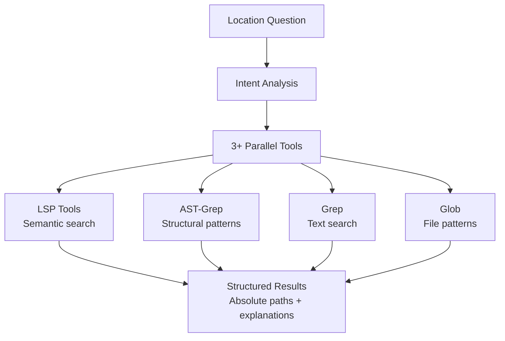
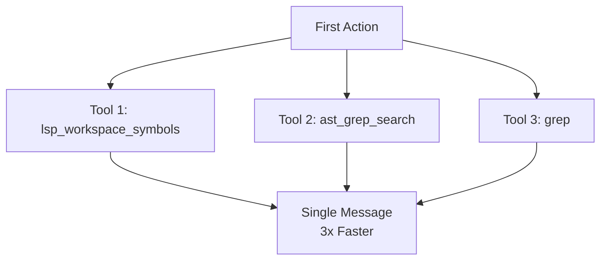
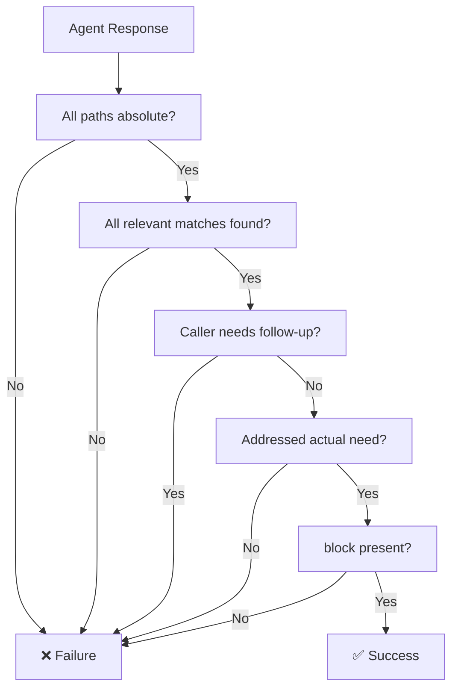
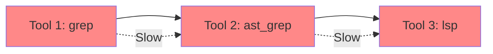
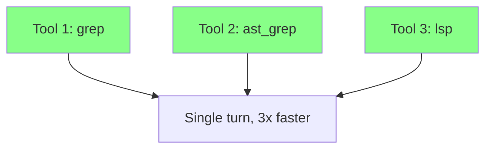

# Explore Agent

Fast codebase search specialist for finding files, code patterns, and implementation locations.

---

## Overview

| Property | Value |
|----------|-------|
| **Name** | explore |
| **Model** | Haiku |
| **Mode** | subagent (READ-ONLY) |
| **Primary Function** | Codebase search, file discovery, pattern matching |

Explore answers questions like "Where is X implemented?", "Which files contain Y?", and "Find the code that does Z" by executing parallel tool searches and returning structured, actionable results.



---

## Critical Requirements

### 1. Intent Analysis (REQUIRED)

Before ANY search, wrap analysis in `<analysis>` tags:

```xml
<analysis>
**Literal Request**: [What they literally asked]
**Actual Need**: [What they're really trying to accomplish]
**Success Looks Like**: [What result would let them proceed immediately]
</analysis>
```

### 2. Parallel Execution (REQUIRED)

Launch **3+ tools simultaneously** in the first action. Sequential execution is only permitted when output explicitly depends on prior results.



### 3. Structured Results (REQUIRED)

Every response MUST end with a `<results>` block:

```xml
<results>
<files>
- /absolute/path/to/file1.ts - [why this file is relevant]
- /absolute/path/to/file2.ts - [why this file is relevant]
</files>

<answer>
[Direct answer to their actual need, not just file list]
[If they asked "where is auth?", explain the auth flow you found]
</answer>

<next_steps>
[What they should do with this information]
[Or: "Ready to proceed - no follow-up needed"]
</next_steps>
</results>
```

---

## Success Criteria

| Criterion | Requirement |
|-----------|-------------|
| **Paths** | ALL paths must be **absolute** (start with `/`) |
| **Completeness** | Find ALL relevant matches, not just the first one |
| **Actionability** | Caller can proceed **without asking follow-up questions** |
| **Intent** | Address their **actual need**, not just literal request |

---

## Failure Conditions

The response has **FAILED** if ANY of these are true:

| Failure Type | Description |
|--------------|-------------|
| **Relative Paths** | Any path is relative (not absolute) |
| **Incomplete Results** | Missed obvious matches in the codebase |
| **Follow-up Required** | Caller needs to ask "but where exactly?" |
| **Literal Only** | Only answered the literal question, not the underlying need |
| **No Results Block** | Missing `<results>` block with structured output |



---

## Tool Strategy

Use the right tool for the search pattern:

| Search Pattern | Primary Tool | Secondary Tools | Use Case |
|----------------|--------------|-----------------|----------|
| **Semantic** | LSP tools | `lsp_goto_definition`, `lsp_find_references` | Finding where symbols are defined/used |
| **Structural** | `ast_grep_search` | `grep` for validation | Pattern matching AST nodes |
| **Text** | `grep` | `lsp_workspace_symbols` | Literal text search |
| **File patterns** | `glob` | N/A | Finding files by pattern |
| **History** | git commands | `git log`, `git blame` | Evolution analysis |

### Tool Access

| Tool | Access | Purpose |
|------|--------|---------|
| **lsp_hover** | ✅ | Type information and documentation |
| **lsp_goto_definition** | ✅ | Jump to symbol definition |
| **lsp_find_references** | ✅ | Find all usages |
| **lsp_workspace_symbols** | ✅ | Search symbols across workspace |
| **ast_grep_search** | ✅ | Pattern-based code search |
| **grep** | ✅ | Literal text search |
| **glob** | ✅ | Find files by pattern |
| **git log** | ✅ | Evolution history |
| **git blame** | ✅ | Line authorship |

---

## Constraints

| Constraint | Reason |
|------------|--------|
| **Read-only** | `tools: { write: false }` - Search agent cannot modify code |
| **No edit operations** | `tools: { edit: false }` - Prevents unintended modifications |
| **No background tasks** | `tools: { background_task: false }` - Avoids recursive spawning |
| **No emojis in output** | Keep output clean and parseable |
| **No file creation** | Report findings as message text only |

---

## Anti-Patterns

### Sequential Execution (BAD)



### Parallel Execution (GOOD)



---

## Example Workflow

### Query: "Where is auth implemented?"

**Step 1: Intent Analysis**

```xml
<analysis>
**Literal Request**: Find where authentication is implemented
**Actual Need**: Understand the auth flow to add a new provider
**Success Looks Like**: Entry points, middleware, and auth configuration files
</analysis>
```

**Step 2: Parallel Search**

```
lsp_workspace_symbols("auth")
ast_grep_search("function.*auth")
grep("authenticate")
glob("**/auth/**/*")
```

**Step 3: Structured Results**

```xml
<results>
<files>
- /src/middleware/auth.ts - Authentication middleware with JWT validation
- /src/modules/auth/auth.controller.ts - Auth endpoints (login, register, refresh)
- /src/modules/auth/auth.service.ts - Core authentication logic
- /src/config/auth.config.ts - Auth configuration and providers
</files>

<answer>
Authentication is implemented as a module with JWT-based tokens. Entry points are in auth.controller.ts (POST /login, POST /register). Middleware protects routes using JWT validation from auth.middleware.ts.
</answer>

<next_steps>
To add a new provider: modify auth.service.ts for the auth logic and auth.config.ts for provider configuration.
</next_steps>
</results>
```

---

## Comparison with Other Agents

| Agent | Scope | Primary Tools |
|-------|-------|---------------|
| **Explore** | Internal codebase | LSP, AST-Grep, grep, glob |
| **Librarian** | External resources | context7, GitHub search, web search |
| **Oracle** | Advisory analysis | LSP, read (deep reasoning) |

---

## See Also

- [Librarian Agent](librarian.md) - External documentation research
- [Oracle Agent](oracle.md) - Architecture and debugging
- [Sisyphus System Overview](../../overview.md) - Orchestration model
