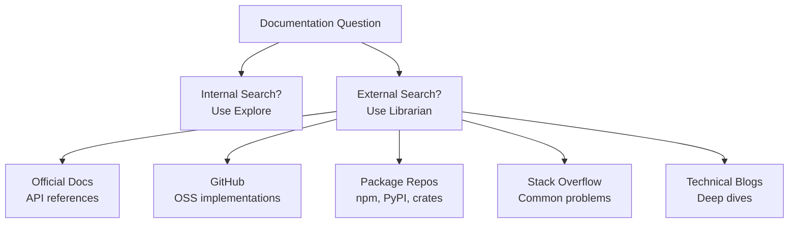
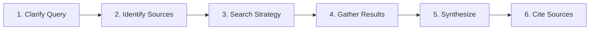

# Librarian Agent

External documentation and reference researcher for finding official docs, OSS implementations, and usage examples.

---

## Overview

| Property | Value |
|----------|-------|
| **Name** | librarian |
| **Model** | Sonnet |
| **Mode** | subagent |
| **Primary Function** | External documentation, GitHub repos, OSS research, package discovery |

Librarian searches EXTERNAL resources-official documentation, open source implementations, package repositories, Stack Overflow, and technical blogs. For internal codebase searches, use the [Explore Agent](explore.md) instead.



---

## Search Scope

### What Librarian Searches (EXTERNAL)

| Source | Use For |
|--------|---------|
| **Official Docs** | API references, best practices, configuration |
| **GitHub** | OSS implementations, code examples, issues |
| **Package Repos** | npm, PyPI, crates.io package details |
| **Stack Overflow** | Common problems and solutions |
| **Technical Blogs** | Deep dives, tutorials |

### What Librarian DOES NOT Search

Use the [Explore Agent](explore.md) for:

- Current project's source code
- Local file contents
- Internal implementations

---

## Research Process



| Step | Description |
|------|-------------|
| **1. Clarify Query** | Understand what exactly is being asked |
| **2. Identify Sources** | Determine which external resources are relevant |
| **3. Search Strategy** | Formulate effective search queries |
| **4. Gather Results** | Collect relevant information from multiple sources |
| **5. Synthesize** | Combine findings into actionable response |
| **6. Cite Sources** | Always link to original sources |

---

## Output Format

Librarian responses follow a structured format:

```markdown
## Query: [What was asked]

## Findings

### [Source 1: e.g., "Official React Docs"]
[Key information from this source]
**Link**: [URL]

### [Source 2: e.g., "GitHub Example"]
[Key information from this source]
**Link**: [URL]

## Summary
[Synthesized answer with recommendations]

## References
- [Title](URL) - [Brief description]
- [Title](URL) - [Brief description]
```

---

## Best Practices

### ALWAYS

- Cite sources with URLs
- Prefer official docs over blog posts
- Note version compatibility issues
- Flag outdated information
- Provide code examples when helpful

### Source Prioritization

| Priority | Source Type | When to Use |
|----------|-------------|-------------|
| **1st** | Official Documentation | API references, configuration |
| **2nd** | GitHub Repositories | Implementation examples |
| **3rd** | Package Registries | Version info, dependencies |
| **4th** | Stack Overflow | Common problems |
| **5th** | Technical Blogs | Tutorials, deep dives |

---

## Example Queries

### Finding Documentation

```
Ask the librarian: How do I use TanStack Query's staleTime option?
```

Librarian will:

1. Search official TanStack Query docs
2. Find GitHub examples
3. Look for Stack Overflow discussions
4. Synthesize the answer with code examples

### Finding OSS Implementations

```
Use librarian to find examples of authentication middleware in Express.js apps
```

Librarian will:

1. Search GitHub for Express auth middleware
2. Find popular open-source implementations
3. Extract common patterns and best practices
4. Provide links to reference implementations

---

## Invocation Examples

```
Have the librarian find official docs for the React useEffect hook
Ask librarian how other projects implement JWT refresh tokens
Use librarian to research best practices for TypeScript error handling
```

---

## See Also

- [Explore Agent](explore.md) - Internal codebase search
- [Oracle Agent](oracle.md) - Architecture and debugging
- [Sisyphus System Overview](../overview.md) - Orchestration model
