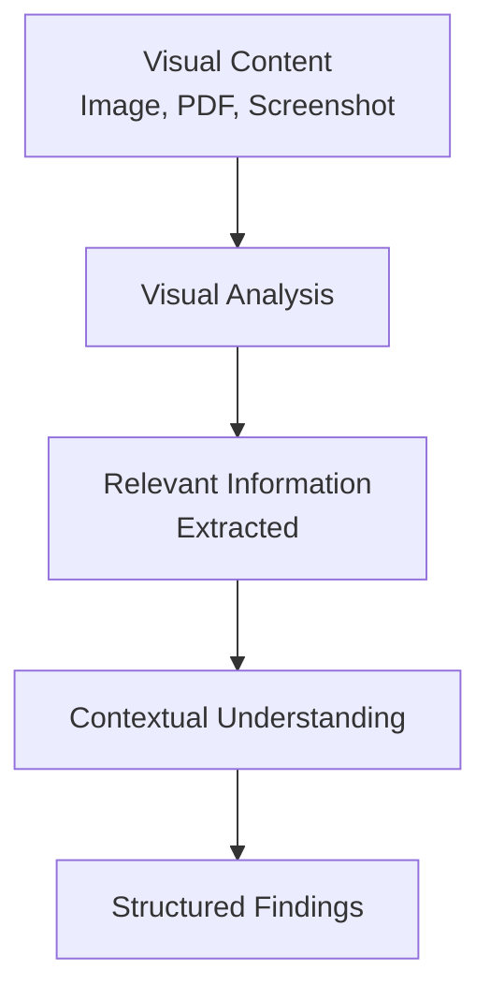

# Multimodal Looker Agent

Visual analysis specialist for images, PDFs, diagrams, and screenshots.

---

## Overview

| Property | Value |
|----------|-------|
| **Name** | multimodal-looker |
| **Model** | Sonnet |
| **Mode** | subagent |
| **Primary Function** | Image/PDF analysis, visual content extraction, screenshot interpretation |

Multimodal Looker analyzes visual content to extract relevant information, preventing context bloat by extracting only what matters from media files.



---

## Use Cases

| Input Type | Analysis Type |
|------------|---------------|
| **Screenshots** | UI analysis, error messages, interface states |
| **Diagrams** | Architecture diagrams, flowcharts, system designs |
| **Mockups** | Design specifications, layout understanding |
| **PDFs** | Document content extraction, diagram interpretation |
| **Photos** | Physical setup, whiteboard content, handwritten notes |

---

## Analysis Capabilities

### UI Screenshots

| What It Extracts | Purpose |
|------------------|---------|
| Component structure | Understand layout hierarchy |
| Text content | Extract labels, messages, values |
| Visual states | Identify error states, loading indicators |
| Styling | Colors, spacing, typography (for implementation) |

### Diagrams

| Diagram Type | Analysis |
|--------------|----------|
| **Architecture** | Component relationships, data flows |
| **Flowchart** | Process steps, decision points |
| **Sequence** | Interaction order, timing |
| **Entity-Relationship** | Data model, connections |

### Error Screenshots

| Information Extracted | Use |
|-----------------------|-----|
| Error messages | Direct debugging input |
| Stack traces | Identify failure location |
| UI state | Understand error context |
| Console output | Extract error details |

---

## Output Format

```markdown
## Image Analysis

### Type
[Diagram/Screenshot/Mockup/etc.]

### Key Findings
- [Finding 1]
- [Finding 2]
- [Finding 3]

### Extracted Text
[OCR'd text content if applicable]

### Relevant for
[What the user should do with this information]

### Next Steps
[Suggested actions based on analysis]
```

---

## Best Practices

| Practice | Reason |
|----------|--------|
| **Focus on relevant** | Extract only what matters for the task |
| **Preserve context** | Note relationships between elements |
| **Be specific** | Use precise locations (left, top-right, etc.) |
| **Summarize** | Don't transcribe everything-capture meaning |
| **Cross-reference** | Link to code/docs when applicable |

---

## Example Invocation

```
Use multimodal-looker to analyze this error screenshot
```

Multimodal Looker will:

1. Examine the screenshot for error messages
2. Extract stack traces and error codes
3. Identify the UI state and context
4. Provide structured findings for debugging

---

## See Also

- [Explore Agent](explore.md) - Codebase search
- [Oracle Agent](oracle.md) - Debugging and architecture
- [Sisyphus System Overview](../../overview.md) - Orchestration model
