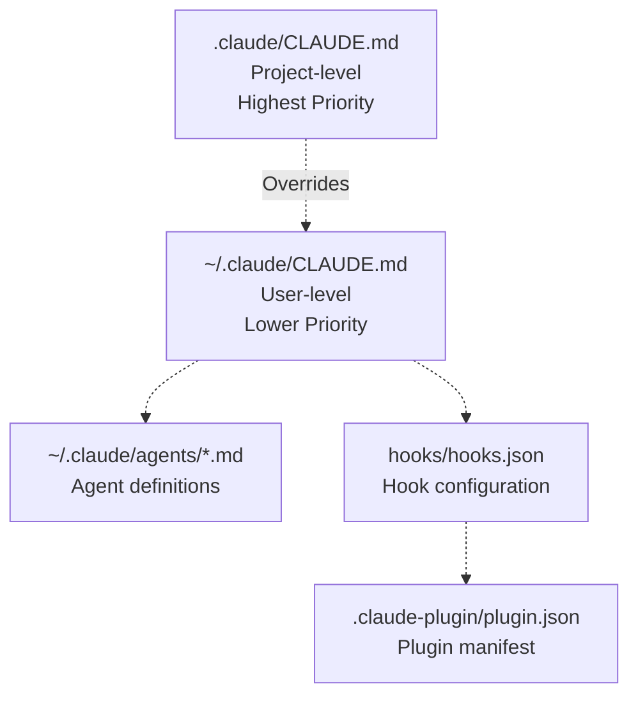

# Configuration

> **Relevant source files**
> * [README.md](https://github.com/Yeachan-Heo/oh-my-claude-sisyphus/blob/main/README.md)
> * [CLAUDE.md](https://github.com/Yeachan-Heo/oh-my-claude-sisyphus/blob/main/CLAUDE.md)
> * [.claude-plugin/plugin.json](https://github.com/Yeachan-Heo/oh-my-claude-sisyphus/blob/main/.claude-plugin/plugin.json)
> * [agents/](https://github.com/Yeachan-Heo/oh-my-claude-sisyphus/tree/main/agents)

Configuration files control oh-my-claude-sisyphus behavior including agent settings, hook behavior, and system prompts. This page explains the configuration structure, file locations, and customization options.

For installation instructions, see [Installation](./installation.md). For basic usage, see [Quick Start](./quick-start.md).

## Configuration Hierarchy

oh-my-claude-sisyphus uses a hierarchical configuration system:



**Configuration Priority:**

| Priority | Path | Purpose |
| --- | --- | --- |
| 1 (Highest) | `.claude/CLAUDE.md` | Project-specific instructions |
| 2 | `~/.claude/CLAUDE.md` | User-level system prompt |
| 3 | `~/.claude/agents/*.md` | Agent definitions |
| 4 | `hooks/hooks.json` | Hook configuration |
| 5 | `.claude-plugin/plugin.json` | Plugin metadata |

**Sources:** [README.md L500-L550](https://github.com/Yeachan-Heo/oh-my-claude-sisyphus/blob/main/README.md#L500-L550)

## File Locations

### User-Level Configuration

Located in your home directory:

```
~/.claude/
├── CLAUDE.md              # Main system prompt
├── agents/                # Agent definitions
│   ├── oracle.md
│   ├── librarian.md
│   ├── explore.md
│   ├── frontend-engineer.md
│   ├── document-writer.md
│   ├── multimodal-looker.md
│   ├── momus.md
│   ├── metis.md
│   ├── sisyphus-junior.md
│   └── prometheus.md
└── commands/              # Slash commands
```

### Project-Level Configuration

Located in your project directory:

```
.claude/
├── CLAUDE.md              # Project-specific instructions
├── agents/                # Project-specific agents (optional)
└── commands/              # Project-specific commands (optional)
```

**Sources:** [README.md L500-L550](https://github.com/Yeachan-Heo/oh-my-claude-sisyphus/blob/main/README.md#L500-L550)

## Main System Prompt (CLAUDE.md)

The `~/.claude/CLAUDE.md` file contains the Sisyphus system prompt that orchestrates multi-agent behavior.

### Structure

```markdown
# Sisyphus Multi-Agent System

You are enhanced with the Sisyphus multi-agent orchestration system.

## INTELLIGENT SKILL ACTIVATION

Skills ENHANCE your capabilities. They are NOT mutually exclusive...

## THE BOULDER NEVER STOPS

Like Sisyphus condemned to roll his boulder eternally...

## Available Subagents

Use the Task tool to delegate to specialized agents...

## Slash Commands

| Command | Description |
---------|-------------
...
```

### Customization

To customize the system prompt:

1. Edit `~/.claude/CLAUDE.md`
2. Preserve the core Sisyphus instructions
3. Add custom rules or preferences

**Example customization:**

```markdown
# Sisyphus Multi-Agent System

[Default content...]

## Project Conventions

- Use TypeScript for all new code
- Follow the project's ESLint configuration
- Write tests alongside source files
- Use functional React components
```

**Sources:** [CLAUDE.md L1-L100](https://github.com/Yeachan-Heo/oh-my-claude-sisyphus/blob/main/CLAUDE.md#L1-L100)

## Agent Configuration

Each agent is defined as a Markdown file in `~/.claude/agents/` with YAML frontmatter.

### Agent File Structure

```markdown
---
name: oracle
description: Architecture and debugging expert
tools: Read, Grep, Glob, Bash, Edit, LSP
model: opus
---

# Oracle Agent

You are a master of software architecture and debugging...

[Agent-specific instructions]
```

### YAML Frontmatter Fields

| Field | Type | Description | Example |
| --- | --- | --- | --- |
| `name` | string | Agent identifier | `oracle` |
| `description` | string | Agent description | `Architecture and debugging expert` |
| `tools` | string[] | Available tools | `Read, Grep, Bash` |
| `model` | string | Claude model to use | `opus`, `sonnet`, `haiku` |

**Sources:** [agents/oracle.md](https://github.com/Yeachan-Heo/oh-my-claude-sisyphus/blob/main/agents/oracle.md)

### Available Models

| Model | Best For | Cost |
| --- | --- | --- |
| `opus` | Complex tasks, architecture, debugging | Highest |
| `sonnet` | General purpose, code understanding | Medium |
| `haiku` | Fast tasks, simple operations | Lowest |

### Agent Customization Examples

**Change Oracle's model:**

```markdown
---
name: oracle
description: Architecture and debugging expert
tools: Read, Grep, Glob, Bash, Edit, LSP
model: sonnet  # Changed from opus
---
```

**Restrict Explore's tools:**

```markdown
---
name: explore
description: Fast codebase exploration
tools: Read, Grep  # Removed Bash, Edit
model: haiku
---
```

**Sources:** [agents/](https://github.com/Yeachan-Heo/oh-my-claude-sisyphus/tree/main/agents)

## Hook Configuration

Hooks are configured in `hooks/hooks.json` at the repository root.

### Hook Configuration Structure

```json
{
  "hooks": {
    "preToolUse": [
      {
        "script": "scripts/think-mode.sh",
        "description": "Activate extended thinking mode"
      },
      {
        "script": "scripts/empty-message-sanitizer.sh",
        "description": "Sanitize empty messages"
      }
    ],
    "postToolUse": [
      {
        "script": "scripts/todo-continuation.sh",
        "description": "Ensure todo list completion"
      }
    ]
  }
}
```

### Hook Types

| Hook Type | Trigger | Purpose |
| --- | --- | --- |
| `preToolUse` | Before tool execution | Validation, transformation |
| `postToolUse` | After tool execution | Cleanup, notification |
| `userPromptSubmit` | Before sending to API | Message validation |
| `sessionCreated` | On session start | Initialization |

**Sources:** [hooks/hooks.json L1-L100](https://github.com/Yeachan-Heo/oh-my-claude-sisyphus/blob/main/hooks/hooks.json#L1-L100)

### Disabling Hooks

To disable a specific hook, remove it from `hooks/hooks.json`:

```json
{
  "hooks": {
    "preToolUse": [
      {
        "script": "scripts/empty-message-sanitizer.sh",
        "description": "Sanitize empty messages"
      }
      // "think-mode" removed
    ]
  }
}
```

**Sources:** [hooks/hooks.json](https://github.com/Yeachan-Heo/oh-my-claude-sisyphus/blob/main/hooks/hooks.json)

## Plugin Configuration

The plugin manifest is defined in `.claude-plugin/plugin.json`.

### Plugin Manifest Structure

```json
{
  "name": "oh-my-claude-sisyphus",
  "version": "2.0.1",
  "description": "Multi-agent orchestration system for Claude Code",
  "author": "Yeachan-Heo",
  "license": "MIT",
  "hooks": "hooks/hooks.json",
  "agents": "agents",
  "commands": "commands",
  "skills": "skills"
}
```

**Sources:** [.claude-plugin/plugin.json L1-L50](https://github.com/Yeachan-Heo/oh-my-claude-sisyphus/blob/main/.claude-plugin/plugin.json#L1-L50)

## Project-Specific Configuration

### Creating .claude/CLAUDE.md

Create a `.claude/CLAUDE.md` file in your project root for project-specific instructions:

```markdown
# Project Context

This is a TypeScript monorepo using:
- Bun runtime
- React for frontend
- PostgreSQL database

## Conventions

- Use functional components
- All API routes in /src/api
- Tests alongside source files

## Architecture

```
src/
├── api/          # API routes
├── components/   # React components
├── lib/          # Shared utilities
└── types/        # TypeScript definitions
```
```

**Sources:** [README.md L500-L550](https://github.com/Yeachan-Heo/oh-my-claude-sisyphus/blob/main/README.md#L500-L550)

### Project-Specific Agents

Create project-specific agents in `.claude/agents/`:

```markdown
---
name: database-expert
description: PostgreSQL database specialist
tools: Read, Grep, Glob, Bash
model: sonnet
---

# Database Expert

You specialize in PostgreSQL queries, schema design, and optimization...

[Project-specific database context]
```

### Project-Specific Commands

Create project-specific commands in `.claude/commands/`:

```markdown
---
description: Run the project's test suite
---

# Test Suite

Usage: `/test`

Runs the full test suite using Bun.
```

**Sources:** [README.md L500-L550](https://github.com/Yeachan-Heo/oh-my-claude-sisyphus/blob/main/README.md#L500-L550)

## Environment Variables

### Required Environment Variables

| Variable | Purpose | Example |
| --- | --- | --- |
| `ANTHROPIC_API_KEY` | Anthropic API authentication | `sk-ant-...` |

### Optional Environment Variables

| Variable | Purpose | Default |
| --- | --- | --- |
| `SISYPHUS_USE_NODE_HOOKS` | Use Node.js hooks instead of Bash | `0` (false) |
| `CLAUDE_DEFAULT_MODEL` | Default model for agents | `opus` |

**Sources:** [README.md L800-L850](https://github.com/Yeachan-Heo/oh-my-claude-sisyphus/blob/main/README.md#L800-L850)

## Auto-Update Configuration

oh-my-claude-sisyphus includes a silent auto-update system.

### Auto-Update Settings

The auto-update system:

* Checks at most once every 24 hours
* Uses a lock file for concurrent safety
* Works on all platforms (Windows, macOS, Linux)

### Manual Update

To manually check for updates:

```bash
# In Claude Code
/update
```

The update command will:

1. Check for new releases on GitHub
2. Download the latest version
3. Install updates to `~/.claude/`
4. Preserve your custom configurations

**Sources:** [README.md L150-L180](https://github.com/Yeachan-Heo/oh-my-claude-sisyphus/blob/main/README.md#L150-L180)

## Configuration Examples

### Minimal Configuration

For a minimal setup, create only `~/.claude/CLAUDE.md`:

```markdown
# Sisyphus Multi-Agent System

[Default installation content...]

## Project Rules

- Follow PEP 8 for Python code
- Write docstrings for all functions
```

### Full Configuration

For a complete setup:

```
~/.claude/
├── CLAUDE.md              # Customized system prompt
├── agents/
│   ├── oracle.md          # Customized agent
│   └── database-expert.md # Custom agent
├── commands/
│   └── deploy.md          # Custom command
└── skills/
    └── my-skill/SKILL.md  # Custom skill
```

### Team Configuration

For team projects, commit `.claude/` to version control:

```bash
# Add to .gitignore (if not tracking)
echo ".claude/" >> .gitignore

# Or commit for team sharing
git add .claude/
git commit -m "Add team configuration"
```

**Sources:** [README.md L500-L550](https://github.com/Yeachan-Heo/oh-my-claude-sisyphus/blob/main/README.md#L500-L550)

## Troubleshooting Configuration

### Agents Not Appearing

**Problem:** Custom agents don't appear in Claude Code

**Solution:** Verify YAML frontmatter is valid:
```markdown
---
name: my-agent
description: My custom agent
tools: Read, Grep
model: sonnet
---
```

### Hooks Not Executing

**Problem:** Hooks are not being triggered

**Solution:** Check `hooks/hooks.json` syntax:
```json
{
  "hooks": {
    "preToolUse": [
      {
        "script": "scripts/my-hook.sh",
        "description": "My hook"
      }
    ]
  }
}
```

Ensure script files are executable:
```bash
chmod +x scripts/*.sh
```

### Configuration Not Loading

**Problem:** Customizations in `CLAUDE.md` not taking effect

**Solution:** Check file locations:

* User-level: `~/.claude/CLAUDE.md`
* Project-level: `.claude/CLAUDE.md`

Project configuration overrides user configuration.

**Sources:** [hooks/hooks.json L1-L100](https://github.com/Yeachan-Heo/oh-my-claude-sisyphus/blob/main/hooks/hooks.json#L1-L100)

## Next Steps

After configuration:

1. **Quick Start**: Learn basic usage patterns. See [Quick Start](./quick-start.md).
2. **Agents**: Learn about specialized agents. See [Agents](../agents/).
3. **Hooks**: Learn about lifecycle hooks. See [Hooks](../hooks/).
4. **Skills**: Learn about composable skills. See [Skills](../skills/).
