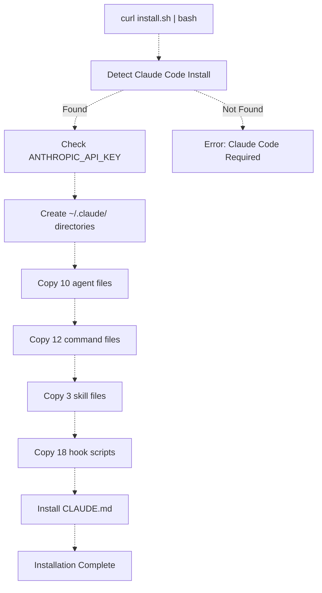

# Installation

> **Relevant source files**
> * [README.md](https://github.com/Yeachan-Heo/oh-my-claude-sisyphus/blob/main/README.md)
> * [scripts/install.sh](https://github.com/Yeachan-Heo/oh-my-claude-sisyphus/blob/main/scripts/install.sh)
> * [.claude-plugin/plugin.json](https://github.com/Yeachan-Heo/oh-my-claude-sisyphus/blob/main/.claude-plugin/plugin.json)

This page details the installation process for oh-my-claude-sisyphus, including prerequisite checks, installation methods, and verification steps.

For configuration after installation, see [Configuration](./configuration.md). For basic usage examples, see [Quick Start](./quick-start.md).

## Prerequisites

### Requirements

oh-my-claude-sisyphus requires:

| Requirement | Version | Purpose |
| ----------- | ------- | ------- |
| **Claude Code** | Latest | Base CLI environment |
| **Anthropic API Key** | - | Authentication via `ANTHROPIC_API_KEY` |
| **Node.js** | 20+ | Required for npm installation (all platforms) |
| **Bash** | Any | Required for curl installation (macOS/Linux) |

**Sources:** [README.md L800-L850](https://github.com/Yeachan-Heo/oh-my-claude-sisyphus/blob/main/README.md#L800-L850)

## Installation Methods

oh-my-claude-sisyphus provides four installation methods:

### Claude Code Plugin (Recommended)

The cleanest installation method integrates directly with Claude Code's plugin system:

```bash
# In Claude Code, run:
/plugin install oh-my-claude-sisyphus

# Or from a marketplace:
/plugin marketplace add Yeachan-Heo/oh-my-claude-sisyphus
/plugin install oh-my-claude-sisyphus@Yeachan-Heo/oh-my-claude-sisyphus
```

**Advantages:**
* Native integration with Claude Code
* Automatic updates via plugin system
* No manual file management

**Sources:** [README.md L60-L80](https://github.com/Yeachan-Heo/oh-my-claude-sisyphus/blob/main/README.md#L60-L80)

### One-Liner Installer (macOS/Linux)

The fastest installation method for Unix-like systems:

```bash
curl -fsSL https://raw.githubusercontent.com/Yeachan-Heo/oh-my-claude-sisyphus/main/scripts/install.sh | bash
```

**What it does:**



**Sources:** [scripts/install.sh L1-L200](https://github.com/Yeachan-Heo/oh-my-claude-sisyphus/blob/main/scripts/install.sh#L1-L200)

### npm Installation (All Platforms including Windows)

The recommended method for Windows users:

```bash
npm install -g oh-my-claude-sisyphus
```

**Advantages:**
* Cross-platform (Windows, macOS, Linux)
* Works without Bash on Windows
* Standard npm package management

**Platform-specific behavior:**

| Platform | Hook Type | Notes |
|----------|-----------|-------|
| **Windows** | Node.js (.mjs) | Requires Node.js 20+ |
| **macOS** | Bash (.sh) or Node.js | Set `SISYPHUS_USE_NODE_HOOKS=1` for Node.js hooks |
| **Linux** | Bash (.sh) or Node.js | Set `SISYPHUS_USE_NODE_HOOKS=1` for Node.js hooks |

**Sources:** [README.md L90-L110](https://github.com/Yeachan-Heo/oh-my-claude-sisyphus/blob/main/README.md#L90-L110)

### Manual Installation (macOS/Linux)

For full control over the installation process:

```bash
# Clone the repository
git clone https://github.com/Yeachan-Heo/oh-my-claude-sisyphus.git
cd oh-my-claude-sisyphus

# Make the installer executable
chmod +x scripts/install.sh

# Run the installer
./scripts/install.sh
```

**Sources:** [README.md L110-L130](https://github.com/Yeachan-Heo/oh-my-claude-sisyphus/blob/main/README.md#L110-L130)

## Installation Structure

The installer creates the following structure in `~/.claude/`:

### Plugin Structure (Claude Code Plugin Format)

```
oh-my-claude-sisyphus/
├── .claude-plugin/
│   └── plugin.json          # Plugin manifest
├── agents/                   # 10 specialized subagents
├── commands/                 # 12 slash commands
├── skills/                   # 3 skills
├── hooks/
│   └── hooks.json           # Hook configuration
└── scripts/                  # Hook scripts
```

### Traditional Installation Structure

```
~/.claude/
├── agents/
│   ├── oracle.md            # Architecture & debugging (Opus)
│   ├── librarian.md         # Documentation & research (Sonnet)
│   ├── explore.md           # Fast pattern matching (Haiku)
│   ├── frontend-engineer.md # UI/UX specialist (Sonnet)
│   ├── document-writer.md   # Technical writing (Haiku)
│   ├── multimodal-looker.md # Visual analysis (Sonnet)
│   ├── momus.md             # Plan reviewer (Opus)
│   ├── metis.md             # Pre-planning consultant (Opus)
│   ├── sisyphus-junior.md   # Focused executor (Sonnet)
│   └── prometheus.md        # Strategic planner (Opus)
├── commands/
│   ├── sisyphus.md          # /sisyphus command
│   ├── sisyphus-default.md  # /sisyphus-default command
│   ├── ultrawork.md         # /ultrawork command
│   ├── deepsearch.md        # /deepsearch command
│   ├── analyze.md           # /analyze command
│   ├── plan.md              # /plan command (Prometheus)
│   ├── review.md            # /review command (Momus)
│   ├── prometheus.md        # /prometheus command
│   ├── orchestrator.md      # /orchestrator command
│   ├── ralph-loop.md        # /ralph-loop command
│   ├── cancel-ralph.md      # /cancel-ralph command
│   └── update.md            # /update command
├── skills/
│   ├── ultrawork/SKILL.md   # Maximum performance mode
│   ├── git-master/SKILL.md  # Git expert skill
│   └── frontend-ui-ux/SKILL.md # UI/UX design skill
└── CLAUDE.md                # Sisyphus system prompt
```

**Sources:** [README.md L140-L200](https://github.com/Yeachan-Heo/oh-my-claude-sisyphus/blob/main/README.md#L140-L200)

## Installed Components

### Ten Subagents

| Agent | File | Model | Purpose |
|-------|------|-------|---------|
| Oracle | `oracle.md` | Opus | Architecture & debugging |
| Librarian | `librarian.md` | Sonnet | Documentation & research |
| Explore | `explore.md` | Haiku | Fast pattern matching |
| Frontend Engineer | `frontend-engineer.md` | Sonnet | UI/UX specialist |
| Document Writer | `document-writer.md` | Haiku | Technical writing |
| Multimodal Looker | `multimodal-looker.md` | Sonnet | Visual analysis |
| Momus | `momus.md` | Opus | Plan reviewer |
| Metis | `metis.md` | Opus | Pre-planning consultant |
| Sisyphus Junior | `sisyphus-junior.md` | Sonnet | Focused executor |
| Prometheus | `prometheus.md` | Opus | Strategic planner |

**Sources:** [README.md L300-L400](https://github.com/Yeachan-Heo/oh-my-claude-sisyphus/blob/main/README.md#L300-L400)

### Twelve Slash Commands

| Command | File | Purpose |
|---------|------|---------|
| `/sisyphus` | `sisyphus.md` | Activate Sisyphus orchestration |
| `/sisyphus-default` | `sisyphus-default.md` | Set Sisyphus as default |
| `/ultrawork` | `ultrawork.md` | Maximum performance mode |
| `/deepsearch` | `deepsearch.md` | Thorough codebase search |
| `/analyze` | `analyze.md` | Deep analysis mode |
| `/plan` | `plan.md` | Start planning session |
| `/review` | `review.md` | Review a plan |
| `/prometheus` | `prometheus.md` | Strategic planning |
| `/orchestrator` | `orchestrator.md` | Complex task coordination |
| `/ralph-loop` | `ralph-loop.md` | Loop until completion |
| `/cancel-ralph` | `cancel-ralph.md` | Cancel Ralph Loop |
| `/update` | `update.md` | Check for updates |

**Sources:** [commands/](https://github.com/Yeachan-Heo/oh-my-claude-sisyphus/tree/main/commands)

### Three Builtin Skills

| Skill | Directory | Purpose |
|-------|-----------|---------|
| Ultrawork | `skills/ultrawork/` | Maximum performance with parallel agents |
| Git Master | `skills/git-master/` | Git expert for atomic commits |
| Frontend UI/UX | `skills/frontend-ui-ux/` | UI/UX design expertise |

**Sources:** [skills/](https://github.com/Yeachan-Heo/oh-my-claude-sisyphus/tree/main/skills)

### Eighteen Lifecycle Hooks

| Hook | Script | Purpose |
|------|--------|---------|
| rules-injector | `rules-injector.sh` | Dynamic rules injection |
| sisyphus-orchestrator | `sisyphus-orchestrator.sh` | Enforces orchestrator behavior |
| auto-slash-command | `auto-slash-command.sh` | Automatic command execution |
| keyword-detector | `keyword-detector.sh` | Magic keyword detection |
| ralph-loop | `ralph-loop.sh` | Self-referential loop management |
| todo-continuation | `todo-continuation.sh` | Ensures task completion |
| context-window-limit-recovery | `context-window-limit-recovery.sh` | Token limit recovery |
| preemptive-compaction | `preemptive-compaction.sh` | Context monitoring |
| session-recovery | `session-recovery.sh` | Session state recovery |
| directory-readme-injector | `directory-readme-injector.sh` | README context injection |
| comment-checker | `comment-checker.sh` | BDD detection |
| thinking-block-validator | `thinking-block-validator.sh` | Extended thinking validation |
| empty-message-sanitizer | `empty-message-sanitizer.sh` | Empty message handling |
| edit-error-recovery | `edit-error-recovery.sh` | Edit error recovery |
| non-interactive-env | `non-interactive-env.sh` | CI environment handling |
| agent-usage-reminder | `agent-usage-reminder.sh` | Agent usage reminders |
| background-notification | `background-notification.sh` | Task completion notifications |
| think-mode | `think-mode.sh` | Extended thinking mode |

**Sources:** [hooks/hooks.json L1-L100](https://github.com/Yeachan-Heo/oh-my-claude-sisyphus/blob/main/hooks/hooks.json#L1-L100)

 [scripts/](https://github.com/Yeachan-Heo/oh-my-claude-sisyphus/tree/main/scripts)

## Verification

After installation completes, verify the setup:

### Check Agent Files

```bash
# Verify agents are installed
ls ~/.claude/agents/
```

Expected output should include:
```
oracle.md
librarian.md
explore.md
frontend-engineer.md
document-writer.md
multimodal-looker.md
momus.md
metis.md
sisyphus-junior.md
prometheus.md
```

### Check Command Files

```bash
# Verify commands are installed
ls ~/.claude/commands/
```

Expected output should include all 12 command files.

### Check Skill Files

```bash
# Verify skills are installed
ls ~/.claude/skills/
```

Expected output:
```
ultrawork
git-master
frontend-ui-ux
```

### Check CLAUDE.md

```bash
# Verify main system prompt
cat ~/.claude/CLAUDE.md
```

Should contain the Sisyphus system prompt with instructions for multi-agent orchestration.

**Sources:** [README.md L200-L220](https://github.com/Yeachan-Heo/oh-my-claude-sisyphus/blob/main/README.md#L200-L220)

## Uninstallation

### Automated Uninstall (macOS/Linux)

```bash
curl -fsSL https://raw.githubusercontent.com/Yeachan-Heo/oh-my-claude-sisyphus/main/scripts/uninstall.sh | bash
```

### Manual Uninstall

```bash
# Remove agents
rm ~/.claude/agents/{oracle,librarian,explore,frontend-engineer,document-writer,multimodal-looker,momus,metis,sisyphus-junior,prometheus}.md

# Remove commands
rm ~/.claude/commands/{sisyphus,sisyphus-default,ultrawork,deepsearch,analyze,plan,review,prometheus,orchestrator,ralph-loop,cancel-ralph,update}.md

# Remove skills
rm -rf ~/.claude/skills/{ultrawork,git-master,frontend-ui-ux}

# Remove main system prompt
rm ~/.claude/CLAUDE.md
```

### npm Uninstall

```bash
npm uninstall -g oh-my-claude-sisyphus
```

**Sources:** [README.md L550-L580](https://github.com/Yeachan-Heo/oh-my-claude-sisyphus/blob/main/README.md#L550-L580)

## Troubleshooting

### Claude Code Not Found

**Error:** `Error: Claude Code is not installed`

**Solution:** Install Claude Code from [https://docs.anthropic.com/claude-code](https://docs.anthropic.com/claude-code)

### ANTHROPIC_API_KEY Not Set

**Error:** `ANTHROPIC_API_KEY environment variable not found`

**Solution:** Set your API key:
```bash
export ANTHROPIC_API_KEY="your-api-key-here"
```

Add to your shell profile (`~/.zshrc`, `~/.bashrc`) for persistence.

### Permission Denied (scripts/install.sh)

**Error:** `bash: scripts/install.sh: Permission denied`

**Solution:** Make the script executable:
```bash
chmod +x scripts/install.sh
./scripts/install.sh
```

### Hook Scripts Not Executing

**Error:** Hooks are not being triggered

**Solution:** Ensure hooks are executable:
```bash
chmod +x ~/.claude/hooks/*.sh
```

**Sources:** [scripts/install.sh L1-L200](https://github.com/Yeachan-Heo/oh-my-claude-sisyphus/blob/main/scripts/install.sh#L1-L200)

## Next Steps

After installation:

1. **Configuration**: Customize agent behavior and system prompts. See [Configuration](./configuration.md).
2. **Quick Start**: Learn basic usage patterns. See [Quick Start](./quick-start.md).
3. **Architecture**: Understand system design. See [Architecture](../architecture/).
4. **Agents**: Learn about specialized agents. See [Agents](../agents/).
