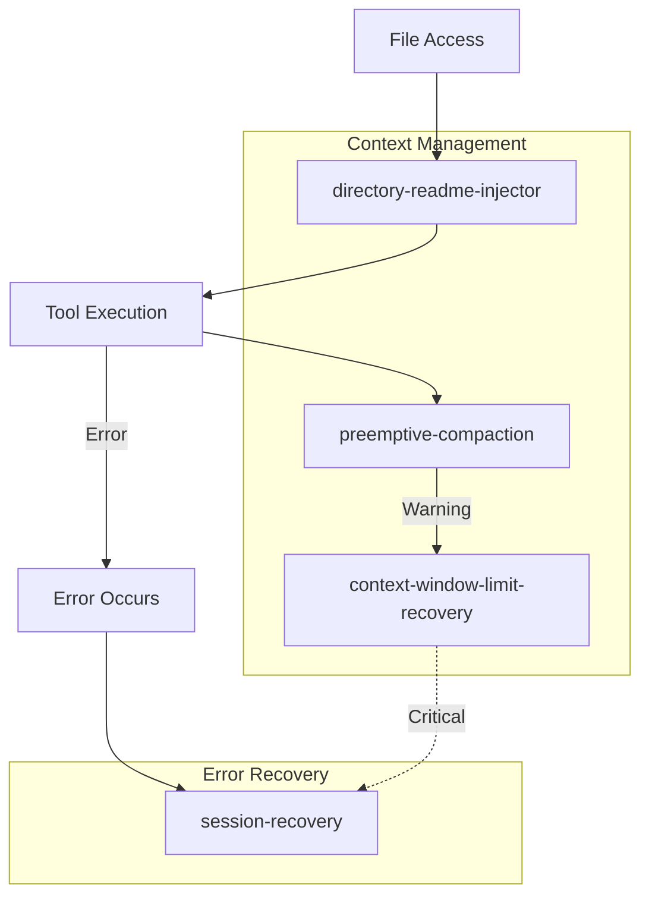

# Context & Recovery Hooks

> **Relevant source files**
> * [src/hooks/context-window-limit-recovery/index.ts](https://github.com/Yeachan-Heo/oh-my-claude-sisyphus/blob/main/src/hooks/context-window-limit-recovery/index.ts)
> * [src/hooks/preemptive-compaction/index.ts](https://github.com/Yeachan-Heo/oh-my-claude-sisyphus/blob/main/src/hooks/preemptive-compaction/index.ts)
> * [src/hooks/session-recovery/index.ts](https://github.com/Yeachan-Heo/oh-my-claude-sisyphus/blob/main/src/hooks/session-recovery/index.ts)
> * [src/hooks/directory-readme-injector/index.ts](https://github.com/Yeachan-Heo/oh-my-claude-sisyphus/blob/main/src/hooks/directory-readme-injector/index.ts)

Context and recovery hooks manage context window usage, recover from errors, and inject relevant project documentation.

## Overview

| Hook | Events | Purpose |
|------|--------|---------|
| **context-window-limit-recovery** | PostToolUse, Error | Detect and recover from token limit errors |
| **preemptive-compaction** | PostToolUse | Warn before hitting context limits |
| **session-recovery** | Error | Fix message structure errors on restart |
| **directory-readme-injector** | PreToolUse | Inject README.md from directory tree |

## Context Window Limit Recovery

The `context-window-limit-recovery` hook detects token limit errors and provides recovery guidance.

### Detected Error Patterns

| Pattern | Description |
|---------|-------------|
| `exceeded maximum context length` | Context window exceeded |
| `tokens exceed` | Token count over limit |
| `context too large` | General size error |
| `non-empty content` | Empty content after truncation |

### Recovery Message

When an error is detected:

```
[CONTEXT LIMIT RECOVERY]
The context window has been exceeded. To recover:

1. Use /compact to summarize the conversation
2. Ask the user to continue with a fresh session
3. Try reducing the amount of content in your responses

Token Details:
- Current: 201,500 tokens
- Maximum: 200,000 tokens
- Over limit by: 1,500 tokens
```

### Retry Configuration

| Setting | Default | Description |
|---------|---------|-------------|
| `maxAttempts` | 3 | Maximum recovery attempts |
| `cooldownMs` | 5000 | Delay between attempts |

### Session State

Recovery state is tracked per session:

```typescript
interface SessionState {
  retryState: {
    attempt: number;
    lastAttemptTime: number;
  };
  truncateState: {
    truncateAttempt: number;
  };
  lastErrorTime: number;
  errorCount: number;
}
```

### Configuration

```json
{
  "hooks": {
    "context-window-limit-recovery": {
      "detailed": true,
      "customMessage": "Custom recovery message"
    }
  }
}
```

### Debug Mode

```bash
export CONTEXT_LIMIT_RECOVERY_DEBUG=1
# Logs to /tmp/context-limit-recovery-debug.log
```

---

## Preemptive Compaction

The `preemptive-compaction` hook monitors context usage and warns before hitting limits.

### Thresholds

| Threshold | Default | Action |
|-----------|---------|--------|
| `warningThreshold` | 80% | Show warning message |
| `criticalThreshold` | 95% | Show critical message, suggest compaction |

### Warning Messages

**Warning (80%):**

```
[CONTEXT WARNING]
You are approaching the context window limit (80% used).
Consider running /compact to free up space.
```

**Critical (95%):**

```
[CONTEXT CRITICAL]
Context window is critically full (95% used).
Run /compact immediately to avoid errors.
```

### Tracked Tools

Only tools that produce large output are tracked:

| Tool | Tracked |
|------|---------|
| `Read` | Yes |
| `Grep` | Yes |
| `Glob` | Yes |
| `Bash` | Yes |
| `WebFetch` | Yes |
| `Edit` | No |
| `Write` | No |

### Cooldown and Limits

| Setting | Default | Description |
|---------|---------|-------------|
| `cooldownMs` | 60000 | Minimum time between warnings |
| `maxWarnings` | 3 | Maximum warnings per session |

### Token Estimation

Uses simple character-based estimation:

```
tokens = ceil(character_count / 4)
```

### Configuration

```json
{
  "hooks": {
    "preemptive-compaction": {
      "warningThreshold": 0.75,
      "criticalThreshold": 0.90,
      "cooldownMs": 30000,
      "maxWarnings": 5
    }
  }
}
```

### Debug Mode

```bash
export PREEMPTIVE_COMPACTION_DEBUG=1
# Logs to /tmp/preemptive-compaction-debug.log
```

---

## Session Recovery

The `session-recovery` hook fixes message structure errors that occur when Claude Code restarts or crashes.

### Recoverable Error Types

| Error Type | Description | Recovery Strategy |
|------------|-------------|-------------------|
| `tool_result_missing` | Tool result not found | Inject cancelled result |
| `thinking_block_order` | Thinking block not first | Move thinking to start |
| `thinking_disabled_violation` | Thinking in non-thinking model | Strip thinking blocks |
| `empty_content` | Message has no content | Inject placeholder text |

### Recovery Strategies

#### Tool Result Missing

Injects a cancelled tool result:

```json
{
  "type": "tool_result",
  "tool_use_id": "<id>",
  "content": "Result cancelled due to session recovery",
  "is_error": false
}
```

#### Thinking Block Order

Prepends thinking part to message parts array:

```json
{
  "type": "thinking",
  "id": "synthetic_thinking",
  "thinking": "<previous_thinking_content>"
}
```

#### Thinking Disabled Violation

Removes all thinking parts from messages:

```typescript
message.parts = message.parts.filter(p => p.type !== 'thinking')
```

#### Empty Content

Adds placeholder text part:

```json
{
  "type": "text",
  "text": "[Recovered empty message]",
  "synthetic": true
}
```

### Storage Locations

Message parts are stored in `.sisyphus/sessions/<id>/parts/`:

```
.sisyphus/sessions/
└── abc123/
    ├── messages.json      # Message metadata
    └── parts/             # Message parts storage
        ├── msg1.json
        ├── msg2.json
        └── ...
```

### Configuration

```json
{
  "hooks": {
    "session-recovery": {
      "customMessages": {
        "tool_result_missing": "Custom recovery message",
        "thinking_block_order": "Custom thinking fix message"
      }
    }
  }
}
```

### Debug Mode

```bash
export SESSION_RECOVERY_DEBUG=1
# Logs to .sisyphus/session-recovery-debug.log
```

---

## Directory README Injector

The `directory-readme-injector` hook automatically injects README.md content when accessing files.

### Directory Tree Walking

When a file is accessed, walks up the directory tree:

```
project/
├── README.md              # Injected first (project-wide)
├── src/
│   ├── README.md          # Injected second (src-specific)
│   └── api/
│       ├── README.md      # Injected third (API-specific)
│       └── handler.ts     # Target file
```

### Injection Order

READMEs are injected from root to leaf:

1. Project root README
2. Parent directory READMEs
3. Immediate directory README

### Session Caching

Each directory is injected once per session:

```
.sisyphus/readme-injected.json
{
  "session-123": {
    "injectedPaths": [
      "/project",
      "/project/src",
      "/project/src/api"
    ]
  }
}
```

### Content Truncation

Large READMEs are truncated to save context:

| Setting | Default | Description |
|---------|---------|-------------|
| `maxReadmeTokens` | 5000 | Maximum tokens per README |

Truncation notice:

```
[Note: Content was truncated to save context window space.
For full context, please read the file directly: <path>]
```

### Tracked Tools

| Tool | Tracked |
|------|---------|
| `Read` | Yes |
| `Grep` | No |
| `Glob` | No |
| `Edit` | Yes |
| `Write` | Yes |

### Configuration

```json
{
  "disabled_hooks": ["directory-readme-injector"]
}
```

## Hook Comparison

| Hook | Reactive/Proactive | State | Storage |
|------|-------------------|-------|---------|
| context-window-limit-recovery | Reactive | In-memory | None |
| preemptive-compaction | Proactive | In-memory | None |
| session-recovery | Reactive | Persistent | `.sisyphus/sessions/` |
| directory-readme-injector | Proactive | Persistent | `.sisyphus/readme-injected.json` |

## Workflow Diagram



## Further Reading

- [Core Hooks](core-hooks.md) - Orchestration and behavior
- [Quality Hooks](quality-hooks.md) - Validation and code quality
- [Environment Hooks](environment-hooks.md) - Environment adaptation
