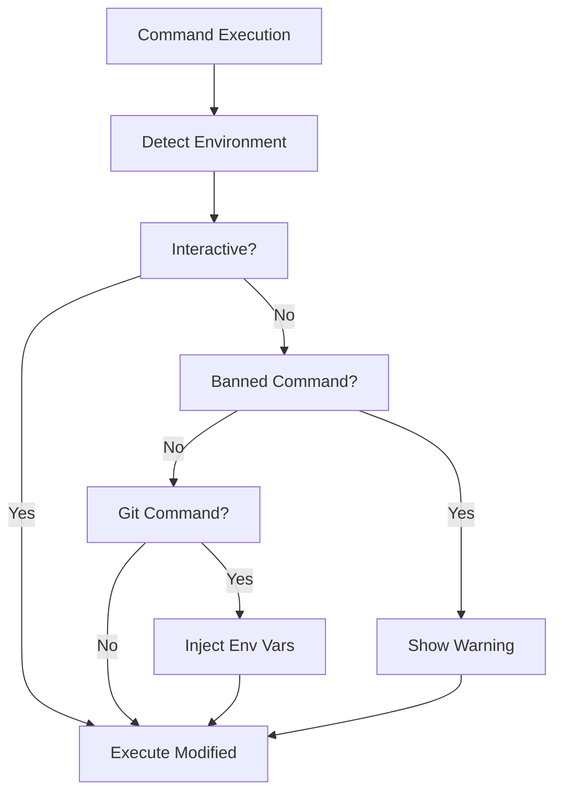
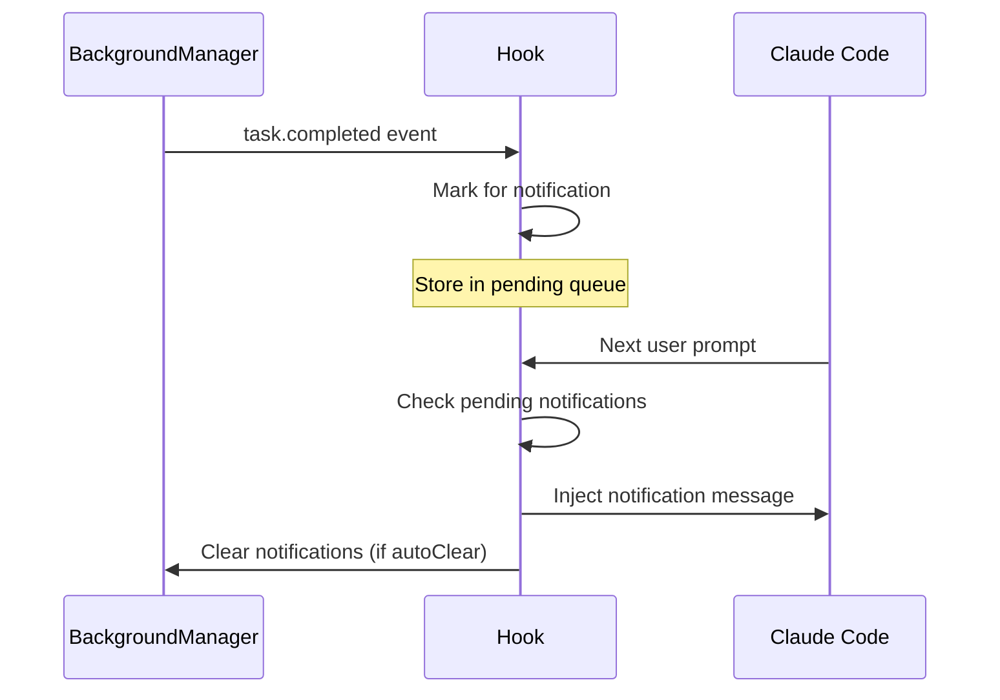

# Environment & Notification Hooks

> **Relevant source files**
> * [src/hooks/non-interactive-env/index.ts](https://github.com/Yeachan-Heo/oh-my-claude-sisyphus/blob/main/src/hooks/non-interactive-env/index.ts)
> * [src/hooks/agent-usage-reminder/index.ts](https://github.com/Yeachan-Heo/oh-my-claude-sisyphus/blob/main/src/hooks/agent-usage-reminder/index.ts)
> * [src/hooks/background-notification/index.ts](https://github.com/Yeachan-Heo/oh-my-claude-sisyphus/blob/main/src/hooks/background-notification/index.ts)
> * [src/hooks/think-mode/index.ts](https://github.com/Yeachan-Heo/oh-my-claude-sisyphus/blob/main/src/hooks/think-mode/index.ts)

Environment and notification hooks adapt behavior to the execution environment and provide status updates for background tasks.

## Overview

| Hook | Events | Purpose |
|------|--------|---------|
| **non-interactive-env** | BeforeCommand | Adapt for CI/non-interactive environments |
| **agent-usage-reminder** | PostToolUse, Event | Suggest specialized agents |
| **background-notification** | Event | Notify of background task completion |
| **think-mode** | ChatParams | Activate extended thinking mode |

## Non-Interactive Environment

The `non-interactive-env` hook detects and adapts for non-interactive environments like CI/CD.

### Detection

Non-interactive environments are detected by:

| Indicator | Description |
|-----------|-------------|
| `CI=true` | Environment variable set by most CI systems |
| `GITHUB_ACTIONS=true` | GitHub Actions |
| `GITLAB_CI=true` | GitLab CI |
| `JENKINS_HOME` | Jenkins |
| `NO_TTY` | No terminal attached |

### Banned Commands

Commands that will hang in non-interactive environments:

| Command | Why Banned |
|---------|------------|
| `vim`, `vi` | Requires terminal interaction |
| `nano` | Requires terminal interaction |
| `less` | Interactive pager |
| `more` | Interactive pager |
| `top`, `htop` | Interactive monitors |
| `emacs` | Interactive editor |

### Git Environment Variables

For git commands, these variables are injected:

```bash
export GIT_TERMINAL_PROMPT=0
export GIT_EDITOR=:
export GIT_PAGER=cat
```

### Modified Command Format

```bash
# Original:
git rebase -i HEAD~3

# Modified (with non-interactive env):
export GIT_TERMINAL_PROMPT=0 GIT_EDITOR=: GIT_PAGER=cat; git rebase -i HEAD~3
```

### Warning Message

```
Warning: 'vim' is an interactive command that may hang in non-interactive environments.
```

### Configuration

Cannot be disabled - required for CI/CD compatibility.

---

## Agent Usage Reminder

The `agent-usage-reminder` hook suggests using specialized agents when users make direct tool calls instead of delegating.

### Target Tools

Tools that trigger the reminder:

| Tool | Recommended Agent |
|------|-------------------|
| `Grep` | `explore` (Haiku - fast search) |
| `Glob` | `explore` (Haiku - fast file finding) |
| `WebFetch` | `librarian` (Sonnet - research) |
| `WebSearch` | `librarian` (Sonnet - research) |

### Agent Tools

Tools that indicate agent usage (suppress reminder):

| Tool | Indicates |
|------|-----------|
| `Task` | Subagent delegation |
| `ask` | Agent consultation |
| `delegate` | Delegation to specialist |

### Reminder Message

```
[AGENT USAGE REMINDER]
Consider using specialized agents for better results:
- Use 'explore' agent for fast file searches (Grep/Glob)
- Use 'librarian' agent for research and documentation (WebFetch/WebSearch)
```

### State Tracking

Reminder state is stored in:

```
.sisyphus/agent-usage.json
{
  "session-123": {
    "agentUsed": false,
    "reminderCount": 2,
    "updatedAt": 1705132800000
  }
}
```

### Reset Conditions

State is reset when:

| Event | Action |
|-------|--------|
| Session deleted | Clear state |
| Session compacted | Clear state |
| Agent tool used | Mark `agentUsed: true` |

### Configuration

```json
{
  "disabled_hooks": ["agent-usage-reminder"]
}
```

---

## Background Notification

The `background-notification` hook handles notifications for background tasks completing.

### Background Task Manager Integration

Integrates with the `BackgroundManager` feature:

```typescript
interface BackgroundTask {
  id: string;
  description: string;
  agent: string;
  status: 'pending' | 'running' | 'completed' | 'error';
  startedAt: Date;
  completedAt?: Date;
  progress?: {
    toolCalls: number;
  };
  result?: string;
  error?: string;
}
```

### Notification Format

Single task:

```
[BACKGROUND TASK COMPLETED]

✓ [COMPLETED] Implement user authentication
  Agent: oracle
  Duration: 2m 15s
  Tool calls: 5
  Result: Authentication system implemented with JWT tokens...
```

Multiple tasks:

```
[3 BACKGROUND TASKS COMPLETED]

✓ [COMPLETED] Fix login bug
  Agent: sisyphus-junior
  Duration: 45s

✓ [COMPLETED] Add unit tests
  Agent: qa-tester
  Duration: 1m 30s

✗ [ERROR] Update documentation
  Agent: document-writer
  Duration: 30s
  Error: File not found: docs/api.md
```

### Configuration Options

| Option | Type | Default | Description |
|--------|------|---------|-------------|
| `autoClear` | boolean | `true` | Clear notifications after showing |
| `formatNotification` | function | default | Custom notification formatter |

### Configuration

```json
{
  "hooks": {
    "background-notification": {
      "autoClear": false
    }
  }
}
```

### Event Types

| Event | Handler Action |
|-------|----------------|
| `task.completed` | Mark task for notification |
| `task.failed` | Mark task for notification |
| Session event | Check and show pending notifications |

---

## Think Mode

The `think-mode` hook activates extended thinking mode when users include think keywords in their prompts.

### Detection Keywords

| Keyword | Effect |
|---------|--------|
| `think` | Switch to high-reasoning model variant |
| `ultrathink` | Maximum reasoning capability |

### Model Switching

When detected, switches to high variant:

| Base Model | High Variant |
|------------|--------------|
| `claude-3-5-sonnet` | `claude-3-5-sonnet-high` |
| `claude-3-5-haiku` | `claude-3-5-opus` |
| `claude-sonnet-4` | `claude-sonnet-4-high` |

### Thinking Configuration

Injects thinking configuration for extended reasoning:

```json
{
  "thinking": {
    "type": "high",
    "budget_tokens": 20000
  }
}
```

### State Management

```typescript
interface ThinkModeState {
  requested: boolean;           // Think keyword detected
  modelSwitched: boolean;       // Model was changed
  thinkingConfigInjected: boolean;  // Config was added
  providerId?: string;          // Original provider
  modelId?: string;             // Original model
}
```

### Usage Examples

```
# Basic think mode
think: Analyze the performance bottleneck

# Ultrathink (maximum reasoning)
ultrathink: Design a distributed system architecture

# Implicit activation
Let me think about this problem carefully...
```

### Configuration

```json
{
  "disabled_hooks": ["think-mode"]
}
```

## Hook Comparison

| Hook | Environment | State | Modifies Commands |
|------|-------------|-------|-------------------|
| non-interactive-env | CI/CD only | No | Yes (git) |
| agent-usage-reminder | All | Persistent | No |
| background-notification | All | Persistent | No |
| think-mode | All | Session | Yes (model selection) |

## Environment Detection Flow



## Background Notification Flow



## Further Reading

- [Core Hooks](core-hooks.md) - Orchestration and behavior
- [Context Recovery](context-recovery.md) - Context window management
- [Quality Hooks](quality-hooks.md) - Validation and code quality
