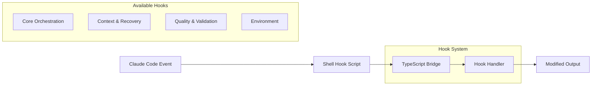
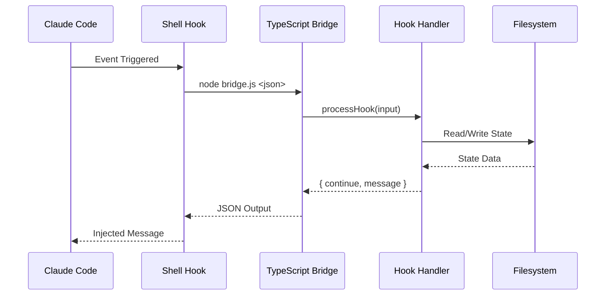

# Hook System Overview

> **Relevant source files**
> * [src/hooks/index.ts](https://github.com/Yeachan-Heo/oh-my-claude-sisyphus/blob/main/src/hooks/index.ts)
> * [README.md](https://github.com/Yeachan-Heo/oh-my-claude-sisyphus/blob/main/README.md)

The hook system provides lifecycle event interception for Claude Code, enabling automatic context injection, error recovery, and behavior enforcement. Hooks integrate with Claude Code's native shell-based hook system.

## Hook Architecture



## Hook Categories

| Category | Purpose | Hooks |
|----------|---------|-------|
| **Core** | Orchestrator behavior, delegation | rules-injector, sisyphus-orchestrator, auto-slash-command, keyword-detector, ralph-loop, todo-continuation |
| **Context** | Window management, recovery | context-window-limit-recovery, preemptive-compaction, session-recovery, directory-readme-injector |
| **Quality** | Code quality, validation | comment-checker, thinking-block-validator, empty-message-sanitizer, edit-error-recovery |
| **Environment** | Environment adaptation | non-interactive-env, agent-usage-reminder, background-notification, think-mode |

## Hook Execution Flow



## Hook Types

### UserPromptSubmit Hooks

Execute before user prompt is submitted to the model.

| Hook | Purpose |
|------|---------|
| rules-injector | Inject project-specific coding rules |
| auto-slash-command | Detect and expand slash commands |
| keyword-detector | Detect magic keywords (ultrawork, search, analyze) |
| directory-readme-injector | Inject README context from directories |
| think-mode | Activate extended thinking mode |

### PostToolUse Hooks

Execute after a tool completes.

| Hook | Purpose |
|------|---------|
| context-window-limit-recovery | Detect and recover from token limit errors |
| preemptive-compaction | Warn before hitting context limits |
| comment-checker | Flag unnecessary comments in code |
| edit-error-recovery | Guide recovery from Edit tool failures |
| background-notification | Notify of background task completion |

### Stop Hooks

Execute when the agent attempts to stop.

| Hook | Purpose |
|------|---------|
| ralph-loop | Prevent stopping until task complete |
| todo-continuation | Ensure all todos are finished |
| sisyphus-orchestrator | Enforce orchestrator delegation |

### Message Transform Hooks

Transform messages before API submission.

| Hook | Purpose |
|------|---------|
| thinking-block-validator | Ensure thinking blocks come first |
| empty-message-sanitizer | Add content to empty messages |

### Event Hooks

Handle session lifecycle events.

| Hook | Purpose |
|------|---------|
| session-recovery | Recover from crash/error states |
| agent-usage-reminder | Suggest specialized agent usage |
| non-interactive-env | Adapt for CI/non-interactive environments |

## Configuration

Hooks are configured via `.claude/hooks.json` in your project:

```json
{
  "hooks": [
    {
      "name": "rules-injector",
      "events": ["UserPromptSubmit"],
      "script": ".sisyphus/hooks/rules-injector.sh"
    },
    {
      "name": "sisyphus-orchestrator",
      "events": ["PreToolUse", "PostToolUse", "Stop"],
      "script": ".sisyphus/hooks/sisyphus-orchestrator.sh"
    }
  ]
}
```

## Disabling Hooks

Individual hooks can be disabled:

```json
{
  "disabled_hooks": [
    "comment-checker",
    "agent-usage-reminder"
  ]
}
```

## Shell Hook Integration

Hooks use Claude Code's native shell hook system:

1. **Shell scripts** (`.sh`) handle event routing
2. **TypeScript bridge** (`.mjs`) provides complex logic
3. **State storage** in `.sisyphus/` directory

**Example shell hook structure:**

```bash
#!/bin/bash
# .sisyphus/hooks/rules-injector.sh

INPUT_JSON=$(cat)
node .sisyphus/dist/hooks/bridge.js rules-injector "$INPUT_JSON"
```

## State Management

Hooks maintain session state in `.sisyphus/`:

```
.sisyphus/
├── rules-injected.json       # rules-injector cache
├── readme-injected.json       # directory-readme-injector cache
├── ralph-state.json           # ralph-loop state
├── todos.json                 # todo-continuation state
├── agent-usage.json           # agent-usage-reminder state
└── sessions/
    └── <session-id>/
        ├── messages.json      # session-recovery cache
        └── parts/             # message parts storage
```

## API Reference

### Hook Input Format

```typescript
interface HookInput {
  sessionId: string;
  messageId?: string;
  event?: string;
  properties?: Record<string, unknown>;
}
```

### Hook Output Format

```typescript
interface HookOutput {
  continue: boolean;        // Allow operation to proceed
  message?: string;         // Message to inject
  modifiedOutput?: string;  // Replacement output
}
```

## Debugging Hooks

Enable debug logging per hook:

```bash
export RULES_INJECTOR_DEBUG=1
export COMMENT_CHECKER_DEBUG=1
export CONTEXT_LIMIT_RECOVERY_DEBUG=1
```

Debug logs are written to `/tmp/`:

- `/tmp/rules-injector-debug.log`
- `/tmp/comment-checker-debug.log`
- `/tmp/context-limit-recovery-debug.log`

## Further Reading

- [Core Hooks](core-hooks.md) - Orchestration and behavior enforcement
- [Context Recovery](context-recovery.md) - Window management and recovery
- [Quality Hooks](quality-hooks.md) - Validation and code quality
- [Environment Hooks](environment-hooks.md) - Environment adaptation
