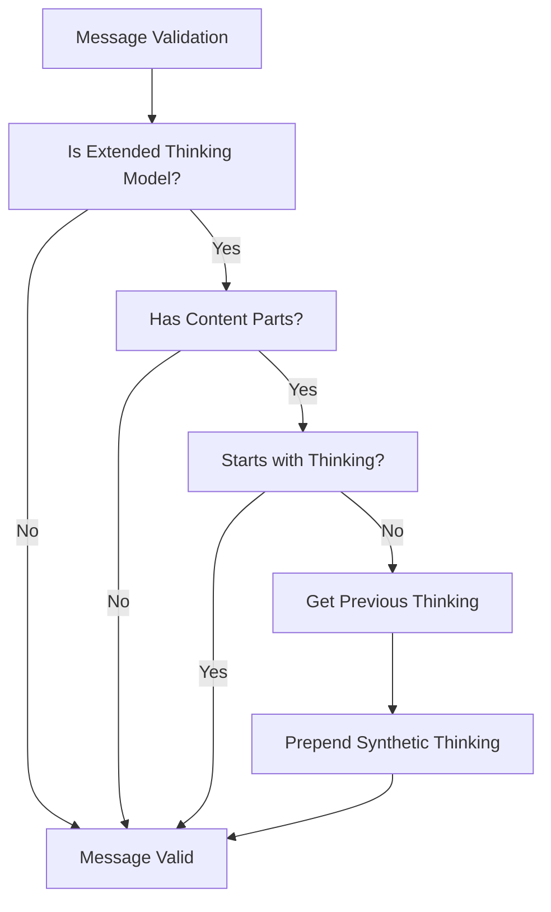
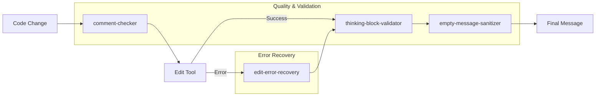

# Quality & Validation Hooks

> **Relevant source files**
> * [src/hooks/comment-checker/index.ts](https://github.com/Yeachan-Heo/oh-my-claude-sisyphus/blob/main/src/hooks/comment-checker/index.ts)
> * [src/hooks/thinking-block-validator/index.ts](https://github.com/Yeachan-Heo/oh-my-claude-sisyphus/blob/main/src/hooks/thinking-block-validator/index.ts)
> * [src/hooks/empty-message-sanitizer/index.ts](https://github.com/Yeachan-Heo/oh-my-claude-sisyphus/blob/main/src/hooks/empty-message-sanitizer/index.ts)
> * [src/hooks/edit-error-recovery/index.ts](https://github.com/Yeachan-Heo/oh-my-claude-sisyphus/blob/main/src/hooks/edit-error-recovery/index.ts)

Quality and validation hooks maintain code quality, validate message structure, and recover from common errors.

## Overview

| Hook | Events | Purpose |
|------|--------|---------|
| **comment-checker** | PreToolUse, PostToolUse | Flag unnecessary comments in code |
| **thinking-block-validator** | MessageTransform | Ensure thinking blocks precede content |
| **empty-message-sanitizer** | MessageTransform | Add content to empty messages |
| **edit-error-recovery** | PostToolUse | Guide recovery from Edit failures |

## Comment Checker

The `comment-checker` hook detects comments in code changes and prompts to justify or remove unnecessary ones.

### Supported Languages

| Extension | Language | Pattern |
|-----------|----------|---------|
| `.ts`, `.tsx` | TypeScript | `//` |
| `.js`, `.jsx` | JavaScript | `//` |
| `.py` | Python | `#` |
| `.rs` | Rust | `//` |
| `.go` | Go | `//` |
| `.java` | Java | `//` |
| `.rb` | Ruby | `#` |
| `.php` | PHP | `//`, `#` |
| `.sh` | Shell | `#` |
| `.c`, `.cpp`, `.h` | C/C++ | `//`, `/* */` |
| `.css`, `.scss` | CSS | `//`, `/* */` |
| `.html` | HTML | `<!-- -->` |

### Comment Types

| Type | Description |
|------|-------------|
| `line` | Single-line comment (`//`, `#`) |
| `block` | Multi-line comment (`/* */`, `<!-- -->`) |
| `docstring` | Documentation string (`"""`, `'''`) |

### Filters

Comments matching these patterns are NOT flagged:

| Filter | Pattern | Reason |
|--------|---------|--------|
| BDD keywords | `given`, `when`, `then`, `and`, `but` | Test steps |
| Type checker | `@ts-check`, `@ts-ignore`, `@type` | Type annotations |
| License | `license`, `copyright`, `(c)` | Legal headers |
| Shebang | `#!` | Interpreter directives |
| Export | `@export`, `@public` | API documentation |

### Output Format

When comments are detected:

```
[COMMENT CHECKER]
The following comments were detected in your changes. Please justify their necessity or remove them.

File: src/auth/login.ts
  Line 15 (line): // Check if user is authenticated
  Line 23 (line): // Return error if invalid

For each comment, either:
1. Remove it (code should be self-documenting)
2. Explain why it's necessary (e.g., non-obvious reasoning)
```

### Configuration

```json
{
  "hooks": {
    "comment-checker": {
      "enabled": true,
      "customPrompt": "Custom comment review message"
    }
  }
}
```

### Debug Mode

```bash
export COMMENT_CHECKER_DEBUG=1
# Logs to /tmp/comment-checker-debug.log
```

---

## Thinking Block Validator

The `thinking-block-validator` hook ensures messages for extended thinking models have thinking blocks before content.

### Extended Thinking Models

Models that require thinking blocks:

| Model Pattern | Requires Thinking |
|---------------|-------------------|
| `*-thinking` | Yes |
| `*-high` | Yes |
| `claude-sonnet-4*` | Yes |
| `claude-opus-4*` | Yes |
| `claude-3*` | Yes |

### Validation Rules

1. Assistant messages must start with `thinking` or `redacted_thinking` part
2. Content parts cannot come before thinking parts
3. If missing, prepend synthetic thinking block

### Synthetic Thinking

Default thinking content when none exists:

```
<thinking>
The user is requesting a task continuation.
I will analyze the current state and proceed accordingly.
</thinking>
```

### Part Types

| Type | Content | Thinking |
|------|---------|----------|
| `text` | Yes | No |
| `thinking` | No | Yes |
| `redacted_thinking` | No | Yes |
| `tool_use` | No | No |
| `tool_result` | No | No |
| `image` | Yes | No |

### Validation Flow



### Configuration

Cannot be disabled - required for API compatibility with extended thinking models.

---

## Empty Message Sanitizer

The `empty-message-sanitizer` hook ensures all messages have non-empty content per Anthropic API requirements.

### API Requirement

Per the Anthropic API spec:

> All messages must have non-empty content except for the optional final assistant message.

### Sanitization Strategy

1. Check if message has valid content (text or tool parts)
2. If empty and not final assistant message:
   - Find existing empty text part and fill it
   - Or inject new text part with placeholder
3. Mark injected parts as `synthetic: true`

### Placeholder Text

```typescript
const PLACEHOLDER_TEXT = "[Session restored after context reduction]";
```

### Part Classification

| Part | Has Content | Notes |
|------|-------------|-------|
| `text` with content | Yes | Valid message part |
| `text` empty | No | Needs sanitization |
| `tool_use` | Yes | Valid for assistant messages |
| `tool_result` | Yes | Valid for user messages |
| `image` | Yes | Valid content |

### Injection Position

Synthetic text parts are inserted:

1. Before first tool part (if exists)
2. At end of parts array (if no tool parts)

### Configuration

```json
{
  "hooks": {
    "empty-message-sanitizer": {
      "placeholderText": "Custom placeholder text"
    }
  }
}
```

### Debug Mode

```bash
export EMPTY_MESSAGE_SANITIZER_DEBUG=1
# Logs to /tmp/empty-message-sanitizer-debug.log
```

---

## Edit Error Recovery

The `edit-error-recovery` hook detects Edit tool failures and provides immediate corrective guidance.

### Detected Error Patterns

| Pattern | Cause |
|---------|-------|
| `oldString and newString must be different` | Trying to edit to same content |
| `oldString not found` | Wrong assumption about file content |
| `oldString found multiple times` | Ambiguous match, need more context |
| `old_string not found` | Snake case variant (older API) |

### Recovery Message

```
[EDIT ERROR - IMMEDIATE ACTION REQUIRED]

You made an Edit mistake. STOP and do this NOW:

1. READ the file immediately to see its ACTUAL current state
2. VERIFY what the content really looks like (your assumption was wrong)
3. APOLOGIZE briefly to the user for the error
4. CONTINUE with corrected action based on the real file content

DO NOT attempt another edit until you've read and verified the file state.
```

### Required Actions

| Step | Action | Purpose |
|------|--------|---------|
| 1 | Read the file | Verify actual content |
| 2 | Compare | Understand the discrepancy |
| 3 | Apologize | Acknowledge the error |
| 4 | Retry | Use correct content |

### Configuration

Cannot be disabled - critical for Edit tool reliability.

## Hook Interaction

These quality hooks work together in sequence:



## Priority Table

When multiple quality hooks apply, execution order is:

| Order | Hook | Phase |
|-------|------|-------|
| 1 | comment-checker | PreToolUse |
| 2 | edit-error-recovery | PostToolUse |
| 3 | thinking-block-validator | MessageTransform |
| 4 | empty-message-sanitizer | MessageTransform |

## Further Reading

- [Core Hooks](core-hooks/) - Orchestration and behavior
- [Context Recovery](context-recovery/) - Context window management
- [Environment Hooks](environment-hooks/) - Environment adaptation
