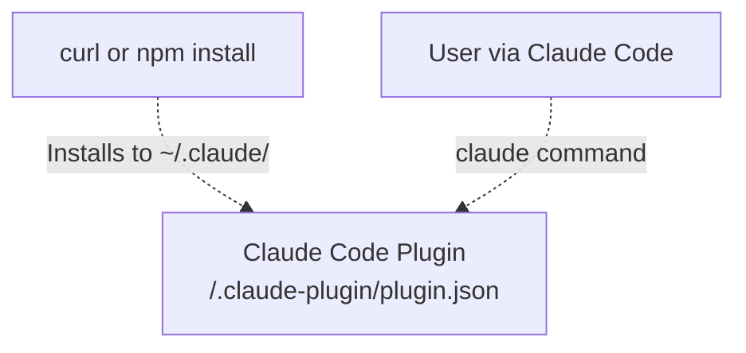
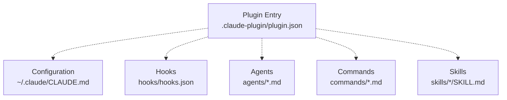
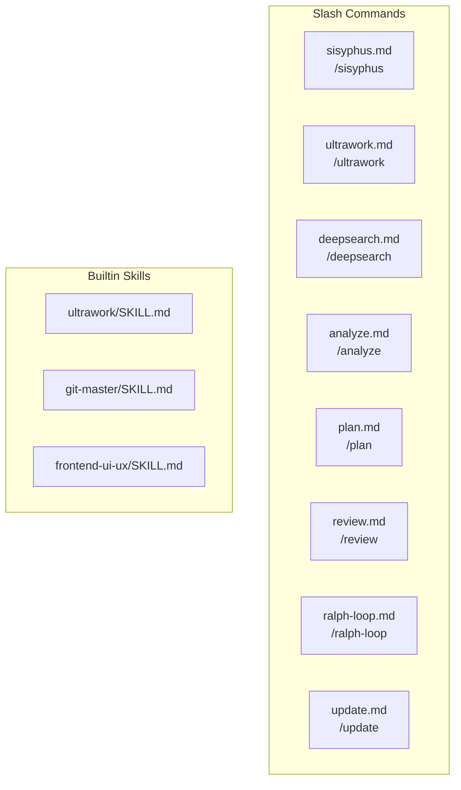
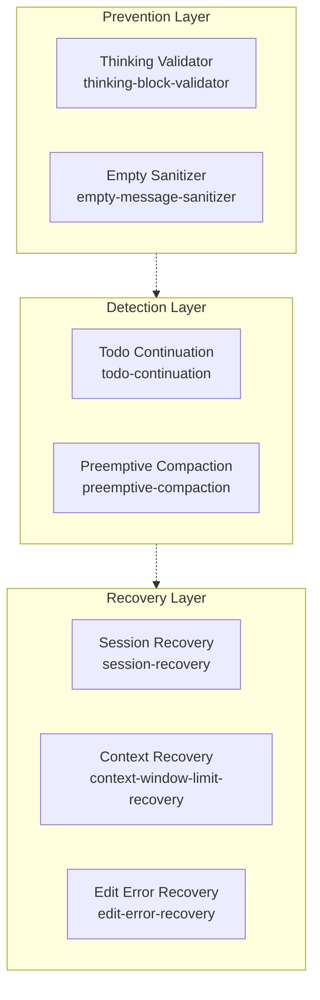
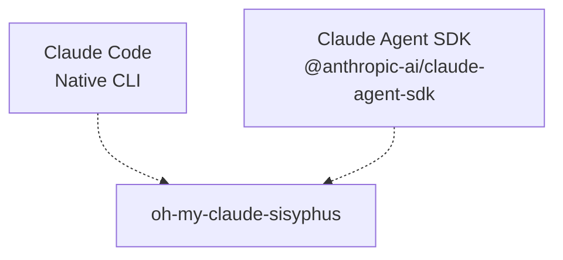

{: .warning }
> **Disclaimer**: This documentation is an independent community resource. It is not affiliated with, endorsed by, or associated with the oh-my-claude-sisyphus, oh-my-opencode, or OpenCode projects.

# Overview

> **Relevant source files**
> * [README.md](https://github.com/Yeachan-Heo/oh-my-claude-sisyphus/blob/main/README.md)
> * [ARCHITECTURE.md](https://github.com/Yeachan-Heo/oh-my-claude-sisyphus/blob/main/docs/ARCHITECTURE.md)
> * [.claude-plugin/plugin.json](https://github.com/Yeachan-Heo/oh-my-claude-sisyphus/blob/main/.claude-plugin/plugin.json)
> * [hooks/hooks.json](https://github.com/Yeachan-Heo/oh-my-claude-sisyphus/blob/main/hooks/hooks.json)

oh-my-claude-sisyphus is a multi-agent orchestration system for [Claude Code](https://docs.anthropic.com/claude-code) that transforms Claude from a single-purpose assistant into a disciplined, production-grade development team. The system extends Claude Code with eleven specialized agents, eighteen lifecycle hooks, six composable skills, and parallel execution capabilities.

**Key Navigation:**

* Getting started: [2](../getting-started/) Installation & Configuration
* Architecture: [3](../architecture/) System Design & Plugin Lifecycle
* Agents: [4](../agents/) Multi-Agent Orchestration
* Hooks: [5](../hooks/) Lifecycle Hooks
* Skills: [6](../skills/) Composable Skills
* Commands: [7](../commands/) Slash Commands

## What is oh-my-claude-sisyphus?

oh-my-claude-sisyphus addresses the fundamental challenge of agent-based development: **making AI agents work like real development teams**. The system provides:

### Eleven Specialized Agents

Ten specialized subagents plus the main orchestrator, each with distinct capabilities:

* **Sisyphus** (Opus 4.5): Primary orchestrator with aggressive delegation
* **Oracle** (Opus): Architecture design and debugging advisor
* **Librarian** (Sonnet): Documentation and research specialist
* **Explore** (Haiku): Fast codebase exploration
* **Frontend Engineer** (Sonnet): UI/UX implementation specialist
* **Document Writer** (Haiku): Technical writing expert
* **Multimodal Looker** (Sonnet): Visual analysis specialist
* **Prometheus** (Opus): Strategic planning with interview workflow
* **Momus** (Opus): Critical plan review and risk assessment
* **Metis** (Opus): Pre-planning consultant
* **Sisyphus Junior** (Sonnet): Focused task executor

**Sources:** [README.md L1-L50](https://github.com/Yeachan-Heo/oh-my-claude-sisyphus/blob/main/README.md#L1-L50)

### Eighteen Lifecycle Hooks

A comprehensive hook system for intercepting and enhancing Claude Code behavior:

* **rules-injector**: Dynamic rules injection with YAML frontmatter parsing
* **sisyphus-orchestrator**: Enforces orchestrator behavior and delegation
* **auto-slash-command**: Automatic slash command detection and execution
* **keyword-detector**: Magic keyword detection (ultrawork, search, analyze)
* **ralph-loop**: Self-referential development loop management
* **todo-continuation**: Ensures todo list completion
* **context-window-limit-recovery**: Token limit error handling
* **preemptive-compaction**: Context usage monitoring
* **session-recovery**: Session state recovery on crashes
* **directory-readme-injector**: README context injection
* **comment-checker**: BDD detection and directive filtering
* **thinking-block-validator**: Extended thinking validation
* **empty-message-sanitizer**: Empty message handling
* **edit-error-recovery**: Automatic recovery from edit errors
* **non-interactive-env**: CI environment handling
* **agent-usage-reminder**: Reminder to use specialized agents
* **background-notification**: Background task completion notifications
* **think-mode**: Extended thinking mode activation

**Sources:** [README.md L1-L50](https://github.com/Yeachan-Heo/oh-my-claude-sisyphus/blob/main/README.md#L1-L50)

 [hooks/hooks.json L1-L100](https://github.com/Yeachan-Heo/oh-my-claude-sisyphus/blob/main/hooks/hooks.json#L1-L100)

### Six Composable Skills

Skills work in three layers that stack additively:

| Layer | Skills | Purpose |
|-------|--------|---------|
| **Execution** | sisyphus, orchestrator, prometheus | HOW you work (pick primary) |
| **Enhancement** | ultrawork, git-master, frontend-ui-ux | ADD capabilities (stack multiple) |
| **Guarantee** | ralph-loop | ENSURE completion |

**Sources:** [README.md L200-L280](https://github.com/Yeachan-Heo/oh-my-claude-sisyphus/blob/main/README.md#L200-L280)

### Auto-Update System

Silent background updates with rate limiting and cross-platform support:

* Checks at most once every 24 hours
* Concurrent-safe lock file prevents conflicts
* Manual update via `/update` command

**Sources:** [README.md L150-L180](https://github.com/Yeachan-Heo/oh-my-claude-sisyphus/blob/main/README.md#L150-L180)

## Why oh-my-claude-sisyphus?

The system is a port of [oh-my-opencode](https://github.com/code-yeongyu/oh-my-opencode), adapted for Claude Code and the Claude Agent SDK. Key differentiators:

**Aggressive Delegation**: Sisyphus delegates everything possible to specialized agents, maintaining clean context and enabling parallel work streams.

**Disciplined Execution**: The Todo Continuation Enforcer prevents the chronic LLM habit of stopping mid-task. Sessions complete or they don't stop.

**Context Intelligence**: Multiple strategies for context management (preemptive compaction, dynamic pruning, tool output truncation) prevent context anxiety.

**Production Reliability**: Session recovery, message validation, and error handling systems ensure sessions survive API failures and model quirks.

**Claude-Native Design**: Uses Claude models exclusively for consistent behavior, simpler authentication, and native tool integration.

**Sources:** [README.md L600-L750](https://github.com/Yeachan-Heo/oh-my-claude-sisyphus/blob/main/README.md#L600-L750)

## System Architecture

oh-my-claude-sisyphus implements a six-layer architecture integrating deeply with Claude Code's plugin system:

### Layer 1: User Interface

**Entry Points:**



Three interaction modes:

* **Plugin Installation**: Via Claude Code plugin system (`/plugin install`)
* **One-line Install**: `curl -fsSL https://raw.githubusercontent.com/.../install.sh | bash`
* **npm Install**: `npm install -g oh-my-claude-sisyphus` (Windows)

**Sources:** [README.md L60-L120](https://github.com/Yeachan-Heo/oh-my-claude-sisyphus/blob/main/README.md#L60-L120)

 [.claude-plugin/plugin.json L1-L50](https://github.com/Yeachan-Heo/oh-my-claude-sisyphus/blob/main/.claude-plugin/plugin.json#L1-L50)

### Layer 2: Plugin Core

**Core Components:**



The plugin manifest orchestrates:

* Configuration loading from `~/.claude/CLAUDE.md`
* Hook initialization (18 lifecycle interceptors)
* Agent registration (11 specialized agents)
* Command registration (12 slash commands)
* Skill registration (6 composable skills)

**Sources:** [.claude-plugin/plugin.json L1-L50](https://github.com/Yeachan-Heo/oh-my-claude-sisyphus/blob/main/.claude-plugin/plugin.json#L1-L50)

 [hooks/hooks.json L1-L100](https://github.com/Yeachan-Heo/oh-my-claude-sisyphus/blob/main/hooks/hooks.json#L1-L100)

### Layer 3: Agent Orchestration

**Sisyphus Orchestration Model:**

```mermaid
flowchart TD

    Sisyphus["Sisyphus Orchestrator<br>anthropic/claude-opus-4-5"]
    Oracle["oracle<br>Opus<br>Architecture & Debugging"]
    Librarian["librarian<br>Sonnet<br>External Research"]
    Explore["explore<br>Haiku<br>Codebase Search"]
    Frontend["frontend-engineer<br>Sonnet<br>UI Implementation"]
    DocWriter["document-writer<br>Haiku<br>Documentation"]
    Multimodal["multimodal-looker<br>Sonnet<br>Media Analysis"]
    Prometheus["prometheus<br>Opus<br>Strategic Planning"]
    Momus["momus<br>Opus<br>Plan Review"]
    Metis["metis<br>Opus<br>Pre-Planning"]
    SisyphusJr["sisyphus-junior<br>Sonnet<br>Focused Execution"]

    Sisyphus -.->|"Complex debugging"| Oracle
    Sisyphus -.->|"External research"| Librarian
    Sisyphus -.->|"Codebase search"| Explore
    Sisyphus -.->|"UI changes"| Frontend
    Sisyphus -.->|"Documentation"| DocWriter
    Sisyphus -.->|"Media analysis"| Multimodal
    Sisyphus -.->|"Strategic planning"| Prometheus
    Sisyphus -.->|"Plan review"| Momus
    Sisyphus -.→ Metis
    Sisyphus -.->|"Direct implementation"| SisyphusJr
```

Agent factory constructs specialized agents with:

* Model assignments optimized for task type
* Tool access restrictions (read-only vs read-write)
* Permission boundaries
* Environment context injection

**Sources:** [agents/](https://github.com/Yeachan-Heo/oh-my-claude-sisyphus/tree/main/agents)

 [README.md L300-L400](https://github.com/Yeachan-Heo/oh-my-claude-sisyphus/blob/main/README.md#L300-L400)

### Layer 4: Command & Skill Layer

**Enhanced Command Ecosystem:**



**Command Categories:**

* **Orchestration**: `/sisyphus`, `/sisyphus-default`, `/orchestrator`
* **Enhancement**: `/ultrawork`, `/deepsearch`, `/analyze`
* **Planning**: `/plan`, `/review`, `/prometheus`
* **Execution**: `/ralph-loop`, `/cancel-ralph`
* **Maintenance**: `/update`

**Sources:** [commands/](https://github.com/Yeachan-Heo/oh-my-claude-sisyphus/tree/main/commands)

 [skills/](https://github.com/Yeachan-Heo/oh-my-claude-sisyphus/tree/main/skills)

### Layer 5: Reliability Layer

**Defense-in-Depth Architecture:**



Three-layer approach:

* **Prevention**: Validates messages before API calls (thinking blocks, empty content)
* **Detection**: Monitors context usage, task completion
* **Recovery**: Automatic fixes for session errors, context limit recovery

**Sources:** [hooks/hooks.json L1-L100](https://github.com/Yeachan-Heo/oh-my-claude-sisyphus/blob/main/hooks/hooks.json#L1-L100)

 [scripts/](https://github.com/Yeachan-Heo/oh-my-claude-sisyphus/tree/main/scripts)

### Layer 6: External Integration

**Provider & Compatibility:**



External integrations:

* **Claude Code**: Foundation CLI and environment
* **Claude Agent SDK**: Programmatic agent orchestration
* **Anthropic API**: Single provider for consistent behavior

**Sources:** [README.md L600-L750](https://github.com/Yeachan-Heo/oh-my-claude-sisyphus/blob/main/README.md#L600-L750)

## Configuration System

The configuration system implements a hierarchical structure with project and user levels:

### Configuration Hierarchy

```mermaid
flowchart TD

    Project["Project Config<br>.claude/CLAUDE.md"]
    User["User Config<br>~/.claude/CLAUDE.md"]
    Agents["Agent Configs<br>~/.claude/agents/*.md"]
    Hooks["Hook Config<br>hooks/hooks.json"]

    Project -.→|"Overrides"| User
    User -.→ Agents
    User -.→ Hooks
```

**Configuration Priority:**

| Priority | Path | Purpose |
| --- | --- | --- |
| 1 (Highest) | `.claude/CLAUDE.md` | Project-specific instructions |
| 2 | `~/.claude/CLAUDE.md` | User-level system prompt |
| 3 | `~/.claude/agents/*.md` | Agent definitions |
| 4 | `hooks/hooks.json` | Hook configuration |

**Sources:** [README.md L500-L550](https://github.com/Yeachan-Heo/oh-my-claude-sisyphus/blob/main/README.md#L500-L550)

## Agent Orchestration Model

The agent system implements a **primary-orchestrator-with-specialists** pattern, where Sisyphus delegates to domain experts based on task classification:

### Orchestration Hierarchy

```mermaid
flowchart TD

    User["User Request<br>(with optional keywords:<br>ultrawork, search, analyze)"]
    KeywordDetect["Keyword Detector<br>keyword-detector hook"]
    Sisyphus["Sisyphus Orchestrator<br>Opus 4.5"]
    Oracle["oracle<br>Opus<br>Architecture & Debugging"]
    Librarian["librarian<br>Sonnet<br>External Research"]
    Explore["explore<br>Haiku<br>Codebase Search"]
    Frontend["frontend-engineer<br>Sonnet<br>UI Implementation"]
    DocWriter["document-writer<br>Haiku<br>Documentation"]
    Multimodal["multimodal-looker<br>Sonnet<br>Media Analysis"]

    User -.->|"activates special modes"| KeywordDetect
    KeywordDetect -.-> Sisyphus
    Sisyphus -.→ Oracle
    Sisyphus -.→ Librarian
    Sisyphus -.→ Explore
    Sisyphus -.→ Frontend
    Sisyphus -.→ DocWriter
    Sisyphus -.→ Multimodal
```

### Agent Configuration Table

| Agent | Model | Mode | Best For |
| --- | --- | --- | --- |
| `Sisyphus` | `claude-opus-4-5` | Orchestrator | Primary coordination, delegation |
| `oracle` | `opus` | Subagent | Complex debugging, architecture |
| `librarian` | `sonnet` | Subagent | Documentation, research |
| `explore` | `haiku` | Subagent | Fast codebase search |
| `frontend-engineer` | `sonnet` | Subagent | UI/UX implementation |
| `document-writer` | `haiku` | Subagent | Technical writing |
| `multimodal-looker` | `sonnet` | Subagent | Visual analysis |
| `prometheus` | `opus` | Subagent | Strategic planning |
| `momus` | `opus` | Subagent | Plan review |
| `metis` | `opus` | Subagent | Pre-planning analysis |
| `sisyphus-junior` | `sonnet` | Subagent | Focused execution |

**Sources:** [agents/](https://github.com/Yeachan-Heo/oh-my-claude-sisyphus/tree/main/agents)

 [README.md L300-L400](https://github.com/Yeachan-Heo/oh-my-claude-sisyphus/blob/main/README.md#L300-L400)

### Delegation Rules

**Clear boundaries prevent overlap:**

* **Oracle**: Called for complex debugging, architecture decisions
* **Librarian**: External research (docs, GitHub, OSS examples)
* **Explore**: Internal codebase search with multiple angles
* **Frontend**: Handles ALL visual changes
* **DocWriter**: All documentation tasks
* **Multimodal**: Media file interpretation
* **Prometheus**: Strategic planning with interview workflow
* **Momus**: Critical plan review and risk assessment
* **Metis**: Pre-planning analysis and ambiguity resolution
* **Sisyphus-Junior**: Focused task execution

**Sources:** [README.md L300-L400](https://github.com/Yeachan-Heo/oh-my-claude-sisyphus/blob/main/README.md#L300-L400)

## Differences from oh-my-opencode

This is a port of [oh-my-opencode](https://github.com/code-yeongyu/oh-my-opencode) adapted for Claude Code. Key differences:

### Model Mapping

| Agent | Original Model | Ported Model |
| --- | --- | --- |
| **Sisyphus** | Claude Opus 4.5 | Claude Opus 4.5 |
| **Oracle** | GPT-5.2 | Claude Opus |
| **Librarian** | Sonnet / Gemini 3 Flash | Claude Sonnet |
| **Explore** | Grok Code / Gemini 3 Flash | Claude Haiku 4.5 |
| **Frontend Engineer** | Gemini 3 Pro | Claude Sonnet |
| **Document Writer** | Gemini 3 Flash | Claude Haiku 4.5 |
| **Multimodal Looker** | Various | Claude Sonnet |

**Why Claude-only?** The Claude Agent SDK is designed for Claude models. Using Claude throughout provides consistent behavior, simpler authentication, and native tool integration.

**Sources:** [README.md L600-L750](https://github.com/Yeachan-Heo/oh-my-claude-sisyphus/blob/main/README.md#L600-L750)

### Architecture Differences

```
oh-my-opencode (Original)    oh-my-claude-sisyphus (Port)
─────────────────────────    ────────────────────────────
┌─────────────────────┐      ┌─────────────────────┐
│ OpenCode Plugin     │      │ Claude Code         │
│ (Bun runtime)       │      │ (Native CLI)        │
└─────────┬───────────┘      └─────────┬───────────┘
          │                            │
┌─────────▼───────────┐      ┌─────────▼───────────┐
│ Multi-Provider      │      │ Claude Agent SDK    │
│ Orchestration       │      │ (Claude only)       │
│ ┌───┐ ┌───┐ ┌───┐  │      └─────────┬───────────┘
│ │GPT│ │Gem│ │Grok│ │                │
│ └───┘ └───┘ └───┘  │      ┌─────────▼───────────┐
└─────────┬───────────┘      │ ~/.claude/agents/    │
          │                  │ (Markdown configs)   │
┌─────────▼───────────┐      └─────────────────────┘
│ Custom Tool Layer   │
│ (LSP, AST, etc.)    │
└─────────────────────┘
```

**Key Architectural Changes:**

1. **Plugin → Native Integration**: Original was an OpenCode plugin; this uses Claude Code's native agent/command system
2. **Multi-Provider → Single Provider**: Simplified to Claude-only for consistency
3. **Custom Runtime → Claude Code Runtime**: Leverages Claude Code's built-in capabilities
4. **Programmatic Config → Markdown Files**: Agents defined as `.md` files in `~/.claude/agents/`

**Sources:** [README.md L600-L750](https://github.com/Yeachan-Heo/oh-my-claude-sisyphus/blob/main/README.md#L600-L750)

## Requirements

* [Claude Code](https://docs.anthropic.com/claude-code) installed
* Anthropic API key (`ANTHROPIC_API_KEY` environment variable)
* **Windows**: Node.js 20+ (for npm installation)
* **macOS/Linux**: Bash shell (default) or Node.js 20+ (optional)

### Platform Support

| Platform | Install Method | Hook Type |
| --- | --- | --- |
| **Windows** | `npm install -g` | Node.js (.mjs) |
| **macOS** | curl or npm | Bash (.sh) |
| **Linux** | curl or npm | Bash (.sh) |

**Sources:** [README.md L800-L850](https://github.com/Yeachan-Heo/oh-my-claude-sisyphus/blob/main/README.md#L800-L850)

## License

MIT - see [LICENSE](https://github.com/Yeachan-Heo/oh-my-claude-sisyphus/blob/main/LICENSE)

## Credits

Inspired by [oh-my-opencode](https://github.com/code-yeongyu/oh-my-opencode) by code-yeongyu.

---

*One must imagine a multi-agent system happy.*

**The boulder never stops.**
