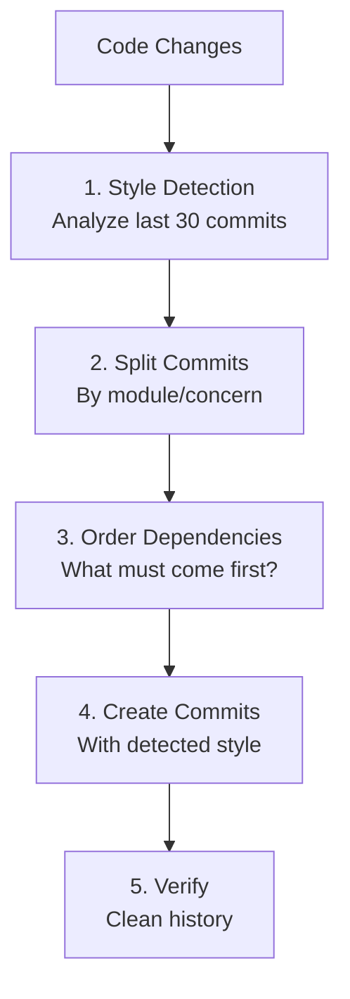
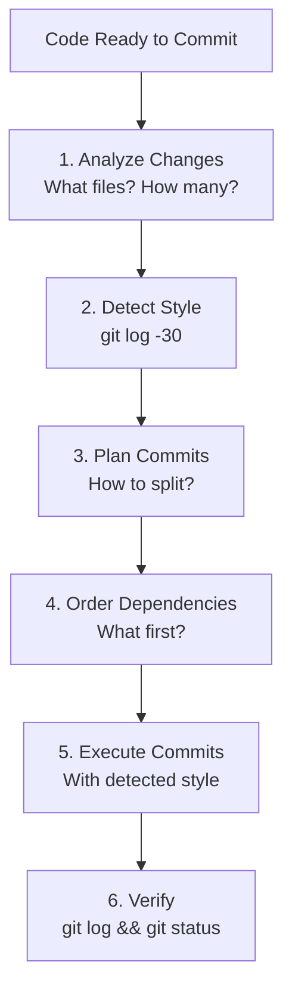

# Git Master Skill

Git expert for atomic commits, rebasing, and history management with style detection.

---

## Overview

| Property | Value |
|----------|-------|
| **Name** | git-master |
| **Type** | Enhancement skill (stackable) |
| **Purpose** | Atomic commits, dependency ordering, style detection, history management |

Git Master combines three specializations:

1. **Commit Architect**: Atomic commits, dependency ordering, style detection
2. **Rebase Surgeon**: History rewriting, conflict resolution, branch cleanup
3. **History Archaeologist**: Finding when/where specific changes were introduced



---

## Core Principle: Multiple Commits by Default

**ONE COMMIT = AUTOMATIC FAILURE**

| Files Changed | Minimum Commits |
|---------------|-----------------|
| 3+ files | 2+ commits |
| 5+ files | 3+ commits |
| 10+ files | 5+ commits |

---

## Style Detection (First Step)

Before committing, analyze the last 30 commits:

```bash
git log -30 --oneline
git log -30 --pretty=format:"%s"
```

### Detect

| Attribute | Options |
|-----------|---------|
| **Language** | Korean vs English (use majority) |
| **Style** | SEMANTIC (feat:, fix:) vs PLAIN vs SHORT |

### Commit Style Examples

| Style | Pattern | Example |
|-------|---------|---------|
| **Semantic** | `type: description` | `feat: add user authentication` |
| **Plain** | `Description in present tense` | `Add user authentication` |
| **Short** | Brief description | `Auth added` |
| **Korean** | Korean description | `사용자 인증 추가` |

---

## Commit Splitting Rules

| Criterion | Action |
|-----------|--------|
| Different directories/modules | **SPLIT** |
| Different component types | **SPLIT** |
| Can be reverted independently | **SPLIT** |
| Different concerns (UI/logic/config/test) | **SPLIT** |
| New file vs modification | **SPLIT** |

### Splitting Example

```
❌ ONE COMMIT (BAD):
"Implement dark mode with settings page and tests"

✅ MULTIPLE COMMITS (GOOD):
1. "feat: add dark mode theme configuration"
2. "feat: create dark mode toggle component"
3. "feat: implement settings page with dark mode"
4. "test: add tests for dark mode switching"
5. "docs: update README with dark mode instructions"
```

---

## History Search Commands

| Goal | Command |
|------|---------|
| When was "X" added? | `git log -S "X" --oneline` |
| What commits touched "X"? | `git log -G "X" --oneline` |
| Who wrote line N? | `git blame -L N,N file.py` |
| When did bug start? | `git bisect start && git bisect bad HEAD && git bisect good <good-commit>` |

---

## Rebase Safety

| Rule | Command |
|------|---------|
| **NEVER** rebase main/master | - |
| Use safe force | `--force-with-lease` |
| **NEVER** use | `--force` |
| Stash dirty files before | `git stash` |

### Rebase Workflow

```bash
# Always use --force-with-lease
git rebase main
git push --force-with-lease

# Safe rebase with stash
git stash
git rebase main
git stash pop
git push --force-with-lease
```

---

## Commit Message Format

### Semantic Commits (if detected)

```
type(scope): subject

body (optional)

footer (optional)
```

| Type | Usage |
|------|-------|
| `feat` | New feature |
| `fix` | Bug fix |
| `docs` | Documentation only |
| `style` | Code style (formatting, etc.) |
| `refactor` | Code refactoring |
| `test` | Adding or updating tests |
| `chore` | Maintenance tasks |

### Plain Commits (if detected)

```
Description in present tense

Additional context if needed
```

---

## Workflow



---

## Activation

### As a Skill

Stacks with other skills:

```
sisyphus + git-master
ultrawork + git-master
```

### Automatic Detection

Git Master activates automatically when:

- Multiple files are changed
- Git operations are performed
- Commits are needed

---

## Best Practices

| Practice | Action |
|----------|--------|
| **Atomic commits** | One logical change per commit |
| **Match style** | Detect and follow repository style |
| **Order dependencies** | Commit what's needed first |
| **Safe rebasing** | Always use --force-with-lease |
| **Clean history** | Rebase before pushing to main |

---

## See Also

- [Sisyphus Skill](../sisyphus/) - Multi-agent orchestration
- [Ultrawork Skill](../ultrawork/) - Maximum performance mode
- [Skills Overview](../overview/) - All available skills
