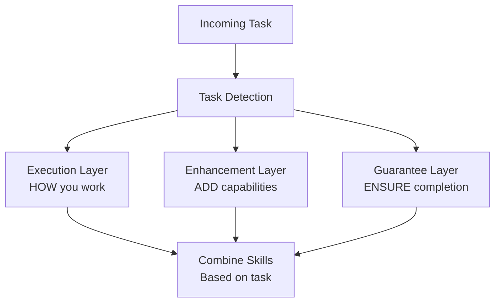

# Skills System

Composable skill enhancements that stack to provide specialized capabilities.

> **Skills are no longer mutually exclusive. Claude automatically combines skills based on task requirements.**

---

## Overview

oh-my-claude-sisyphus provides six built-in skills that enhance Claude Code's capabilities. Skills work in **three composable layers** that stack additively.



---

## Skill Layers

Skills work in **three composable layers**:

| Layer | Skills | Purpose |
|-------|--------|---------|
| **Execution** | sisyphus, orchestrator, prometheus | HOW you work (pick primary) |
| **Enhancement** | ultrawork, git-master, frontend-ui-ux | ADD capabilities (stack multiple) |
| **Guarantee** | ralph-loop | ENSURE completion |

**Combination Formula:**

```
[Execution] + [0-N Enhancements] + [Optional Guarantee]
```

---

## Available Skills

### Execution Skills (Primary)

| Skill | Purpose |
|-------|---------|
| **sisyphus** | Multi-agent orchestration mode |
| **orchestrator** | Master coordinator for complex tasks |
| **prometheus** | Strategic planning with interview workflow |

### Enhancement Skills (Stackable)

| Skill | Purpose |
|-------|---------|
| **ultrawork** | Maximum performance with parallel agents |
| **git-master** | Git expert for atomic commits and history |
| **frontend-ui-ux** | Designer-turned-developer UI/UX expertise |

### Guarantee Skills

| Skill | Purpose |
|-------|---------|
| **ralph-loop** | Self-referential development until completion |

---

## Task Type Detection

Claude uses judgment to detect task type and activate appropriate skill combinations:

| Task Type | Skill Combination | When |
|-----------|-------------------|------|
| **Multi-step implementation** | `sisyphus` | Building features, refactoring |
| **+ parallel subtasks** | `sisyphus + ultrawork` | 3+ independent subtasks |
| **+ multi-file changes** | `sisyphus + git-master` | Changes span 3+ files |
| **+ must complete** | `sisyphus + ralph-loop` | User emphasizes completion |
| **UI/frontend work** | `sisyphus + frontend-ui-ux` | Components, styling |
| **Complex debugging** | `oracle` → `sisyphus` | Root cause → fix |
| **Strategic planning** | `prometheus` | Need plan first |
| **Maximum performance** | `ultrawork` (stacks) | Speed critical |

---

## Combination Examples

```
"Add dark mode with proper commits"
→ sisyphus + frontend-ui-ux + git-master

"ultrawork: refactor the entire API layer"
→ ultrawork + sisyphus + git-master

"Plan auth system, then implement it completely"
→ prometheus (first) → sisyphus + ralph-loop (after plan)

"Fix this bug, don't stop until it's done"
→ sisyphus + ralph-loop
```

---

## Activation Methods

### Slash Commands

| Command | Effect |
|---------|--------|
| `/sisyphus` | Activate Sisyphus multi-agent orchestration |
| `/sisyphus-default` | Set Sisyphus as permanent default |
| `/ultrawork` | Maximum performance mode |
| `/plan` | Start planning session with Prometheus |
| `/review` | Review a plan with Momus |
| `/ralph-loop` | Self-referential loop until completion |
| `/cancel-ralph` | Cancel active Ralph Loop |

### Magic Keywords

Include these words in your prompt:

| Keyword | Effect |
|---------|--------|
| `ultrawork`, `ulw`, `uw` | Activates parallel agent orchestration |
| `search`, `find`, `locate` | Enhanced search mode |
| `analyze`, `investigate` | Deep analysis mode |

---

## Skill Stacking Rules

### Compatible Stacks

| Stack | Valid | Reason |
|-------|-------|--------|
| `sisyphus + ultrawork` | ✅ | Parallel execution enhancement |
| `sisyphus + git-master` | ✅ | Atomic commit enhancement |
| `sisyphus + frontend-ui-ux` | ✅ | UI/UX enhancement |
| `sisyphus + ralph-loop` | ✅ | Completion guarantee |
| `ultrawork + git-master + frontend-ui-ux` | ✅ | All enhancements stack |

### Conflict Resolution

| Conflict | Resolution |
|----------|------------|
| Multiple execution skills | First one takes precedence |
| Enhancement + Guarantee | Both apply |

---

## See Also

- [Sisyphus Skill](sisyphus.md) - Multi-agent orchestration
- [Ultrawork Skill](ultrawork.md) - Maximum performance mode
- [Git Master Skill](git-master.md) - Atomic commits expert
- [Frontend UI/UX Skill](frontend-ui-ux.md) - Designer-developer
- [Ralph Loop Skill](ralph-loop.md) - Completion guarantee
