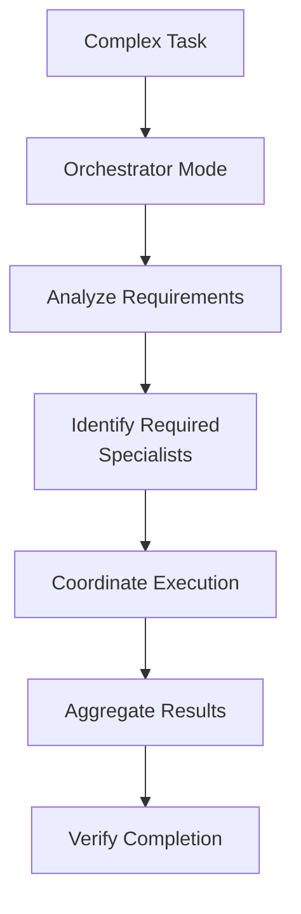
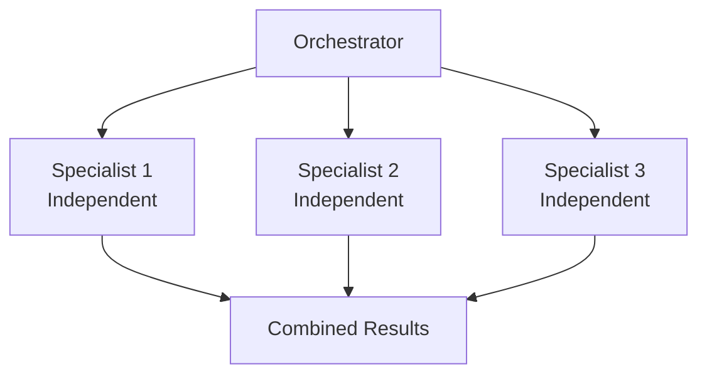
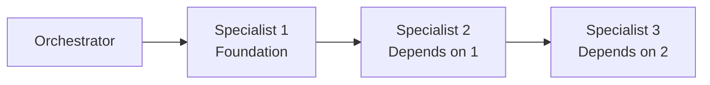
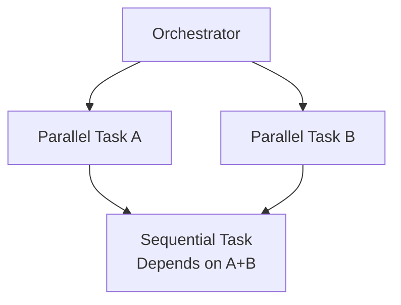

# Orchestrator Skill

Master coordinator for complex multi-step tasks requiring careful coordination.

---

## Overview

| Property | Value |
|----------|-------|
| **Name** | orchestrator |
| **Type** | Execution skill (primary) |
| **Purpose** | Complex multi-step task coordination, specialist coordination |

The Orchestrator skill is designed for tasks that require coordinating multiple specialists and managing complex workflows. It's now the default behavior of Claude Code with oh-my-claude-sisyphus.



---

## What Orchestrator Provides

| Capability | Description |
|------------|-------------|
| **Specialist Coordination** | Route work to appropriate specialists |
| **Workflow Management** | Manage dependencies between tasks |
| **Result Aggregation** | Combine outputs from multiple agents |
| **Quality Verification** | Ensure all work meets standards |

---

## When to Use Orchestrator

| Task Type | Why Orchestrator |
|-----------|------------------|
| **Multi-disciplinary work** | Requires frontend + backend + docs |
| **Complex refactoring** | Affects multiple modules |
| **Feature implementation** | Needs architecture, UI, tests |
| **Debugging complex issues** | Needs research + analysis + fixes |

---

## Coordination Patterns

### Parallel Independent Tasks



### Sequential Dependent Tasks



### Mixed Workflow



---

## Specialist Selection

The Orchestrator routes tasks to appropriate specialists:

| Task Category | Specialist |
|---------------|------------|
| **Architecture/Debugging** | Oracle |
| **External Research** | Librarian |
| **Code Search** | Explore |
| **UI/UX** | Frontend Engineer |
| **Documentation** | Document Writer |
| **Visual Analysis** | Multimodal Looker |
| **Planning** | Prometheus |
| **Review** | Momus |

---

## Activation

### Slash Command

```
/orchestrator [complex task description]
```

### Automatic Detection

The orchestrator activates automatically for:

- Multi-step tasks
- Tasks requiring multiple specialists
- Complex workflows with dependencies

---

## Example Usage

```
/orchestrator Implement a dashboard with charts, user settings, and documentation

[Orchestrator coordinates:]
- Frontend Engineer for UI components
- Document Writer for API docs
- Parallel execution where possible
- Verification of all components
```

---

## See Also

- [Sisyphus Skill](sisyphus.md) - Multi-agent orchestration
- [Ultrawork Skill](ultrawork.md) - Maximum performance mode
- [Skills Overview](overview.md) - All available skills
