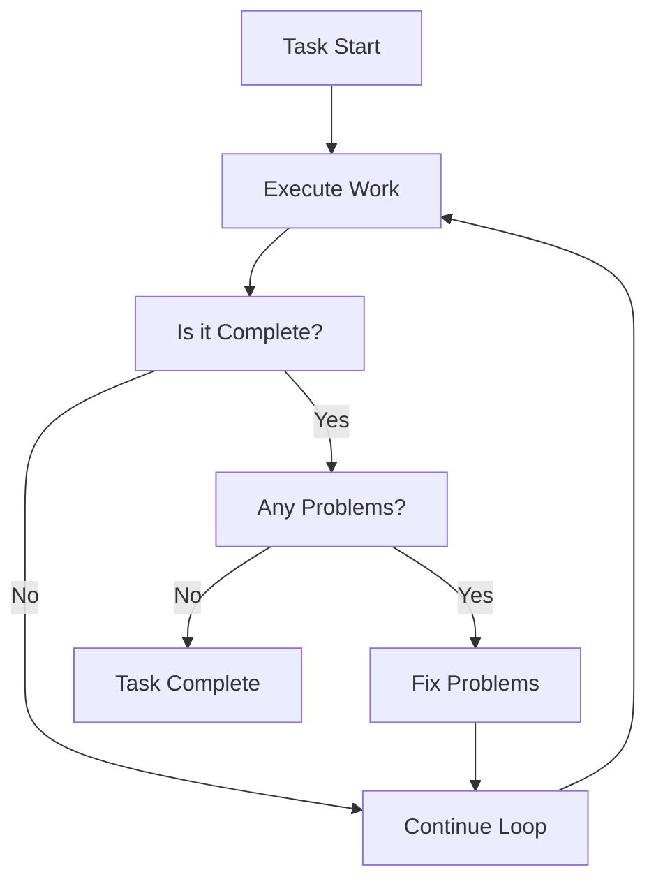

# Ralph Loop Skill

Self-referential development loop that continues until task completion.

> **Named after Ralph Wiggum's persistent nature—the loop continues until done.**

---

## Overview

| Property | Value |
|----------|-------|
| **Name** | ralph-loop |
| **Type** | Guarantee skill |
| **Purpose** | Self-referential development until completion |

Ralph Loop ensures tasks are completed by creating a persistent loop that continues until all work is verified as done. It's the completion guarantee for the Sisyphus system.



---

## What Ralph Loop Ensures

| Guarantee | Description |
|-----------|-------------|
| **Persistence** | Continue until todo list is empty |
| **Verification** | All work verified before stopping |
| **Recovery** | Automatically retry failed operations |
| **Completion** | Never leave work incomplete |

---

## Loop Behavior

### The Loop Continues Until:

| Condition | Status |
|-----------|--------|
| **All todos completed** | Required |
| **All tests passing** | Required (if applicable) |
| **All errors resolved** | Required |
| **Build successful** | Required (if applicable) |
| **Functionality verified** | Required |

### The Loop Retries On:

| Failure Type | Action |
|--------------|--------|
| **Test failures** | Fix and retry |
| **Build errors** | Fix and retry |
| **Lint errors** | Fix and retry |
| **Runtime errors** | Debug and retry |
| **Incomplete tasks** | Continue working |

---

## Verification Criteria

Before the loop can exit:

```markdown
## Ralph Loop Verification Checklist

### TODO List
- [ ] Zero pending tasks
- [ ] Zero in_progress tasks

### Functionality
- [ ] All requested features work
- [ ] Manual testing passed

### Tests
- [ ] All tests pass
- [ ] No test failures

### Build
- [ ] Build succeeds
- [ ] No build errors

### Code Quality
- [ ] No lint errors
- [ ] LSP diagnostics clean

**If ANY checkbox is unchecked, CONTINUE THE LOOP.**
```

---

## Activation

### Slash Command

```
/ralph-loop [task description]
```

### Magic Keywords

Use in your prompt when emphasizing completion:

- "don't stop until it's done"
- "keep working until it works"
- "complete this fully"

---

## Cancellation

To cancel an active Ralph Loop:

```
/cancel-ralph
```

---

## Example Usage

```
/ralph-loop Fix the authentication bug and don't stop until it works

[Ralph Loop activates:]
1. Creates TODOs for the fix
2. Executes the fix
3. Runs tests
4. If tests fail → fix and retry
5. If build fails → fix and retry
6. Only stops when:
   - All tests pass
   - Build succeeds
   - TODO list is empty
   - Functionality verified
```

---

## Stacking

Ralph Loop stacks with other skills as the guarantee layer:

| Stack | Result |
|-------|--------|
| `sisyphus + ralph-loop` | Multi-agent with completion guarantee |
| `ultrawork + ralph-loop` | Maximum performance with guarantee |
| `prometheus → sisyphus + ralph-loop` | Plan then execute to completion |

---

## See Also

- [Sisyphus Skill](sisyphus.md) - Multi-agent orchestration
- [Ultrawork Skill](ultrawork.md) - Maximum performance mode
- [Skills Overview](overview.md) - All available skills
