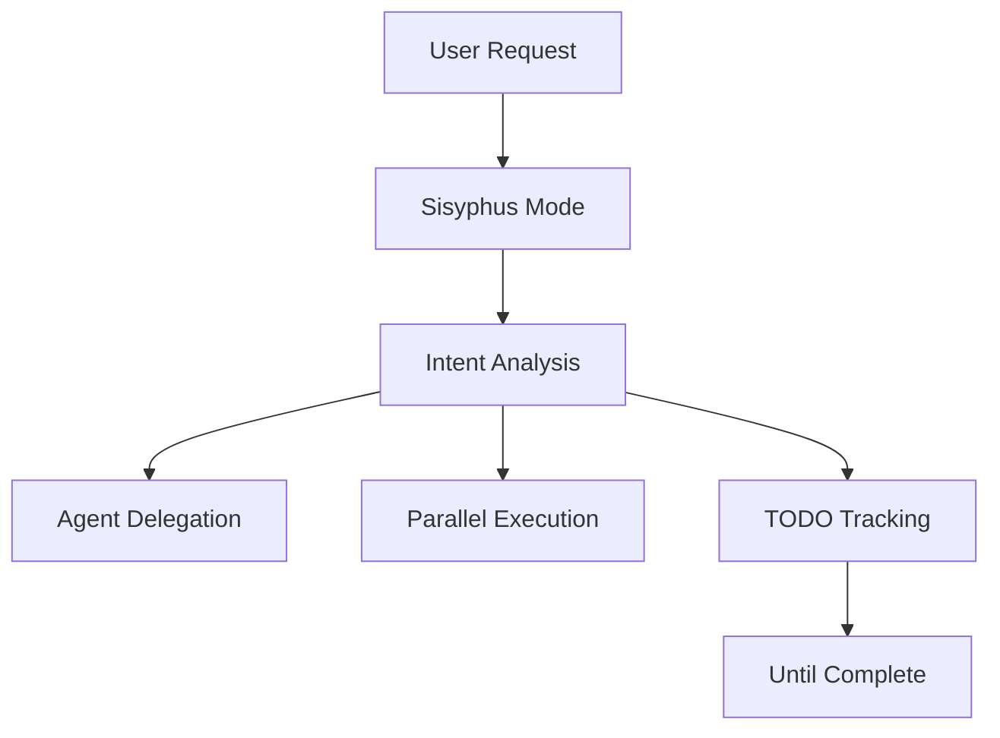
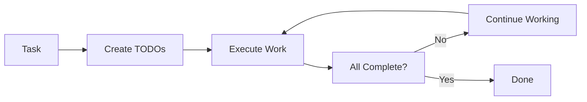

# Sisyphus Skill

Multi-agent orchestration mode for complex development tasks.

> **Like Sisyphus, these agents persist until every task is complete.**

---

## Overview

| Property | Value |
|----------|-------|
| **Name** | sisyphus |
| **Type** | Execution skill (primary) |
| **Purpose** | Multi-agent orchestration, task delegation, todo tracking |

Sisyphus is the default orchestration mode in oh-my-claude-sisyphus. It manages agent delegation, parallel execution, and task tracking.



---

## What Sisyphus Provides

| Capability | Description |
|------------|-------------|
| **Smart Delegation** | Route tasks to specialist agents automatically |
| **Parallel Execution** | Run independent tasks concurrently |
| **TODO Tracking** | Create and track todos for multi-step work |
| **Background Execution** | Long-running operations run async |
| **Persistence** | Continue until all todos are complete |

---

## Delegation Patterns

Sisyphus delegates to specialized agents based on task characteristics:

| Trigger | Agent |
|---------|-------|
| Architecture decisions, debugging | Oracle |
| External docs, OSS examples | Librarian |
| Code location questions | Explore |
| UI/UX, styling, components | Frontend Engineer |
| Documentation tasks | Document Writer |
| Image/screenshot analysis | Multimodal Looker |

---

## TODO Obsession

Sisyphus is obsessed with task tracking:

| Rule | Requirement |
|------|-------------|
| **2+ steps** | Create TODOs with atomic breakdown |
| **Before starting** | Mark in_progress (ONE at a time) |
| **After completion** | Mark completed IMMEDIATELY |
| **No batching** | NEVER batch completions |

> **No todos on multi-step work = INCOMPLETE WORK.**

---

## The Boulder Never Stops

Sisyphus follows a simple philosophy:



| Principle | Action |
|-----------|--------|
| **Persistence** | Continue until todo list is empty |
| **Verification** | Check all tasks before declaring complete |
| **No stopping** | Never leave work incomplete |

---

## Activation

### Slash Command

```
/sisyphus [task description]
```

### Set as Default

```
/sisyphus-default
```

Sets Sisyphus as the permanent default mode.

### Magic Keywords

No magic keywords needed-Sisyphus is now the default behavior.

---

## Example Usage

```
/sisyphus Implement user authentication with JWT

[Sisyphus creates TODOs, delegates to Oracle for architecture,
delegates to Frontend Engineer for login UI, tracks progress]
```

---

## Stacking with Other Skills

Sisyphus combines with enhancement skills:

| Stack | Result |
|-------|--------|
| `sisyphus + ultrawork` | Parallel multi-agent execution |
| `sisyphus + git-master` | Multi-step work with atomic commits |
| `sisyphus + frontend-ui-ux` | Orchestration with UI/UX focus |
| `sisyphus + ralph-loop` | Completion guarantee |

---

## See Also

- [Ultrawork Skill](ultrawork/) - Maximum performance mode
- [Orchestrator](../../agents/orchestration/orchestrator-sisyphus/) - Coordination details
- [Skills Overview](../overview/) - All available skills
