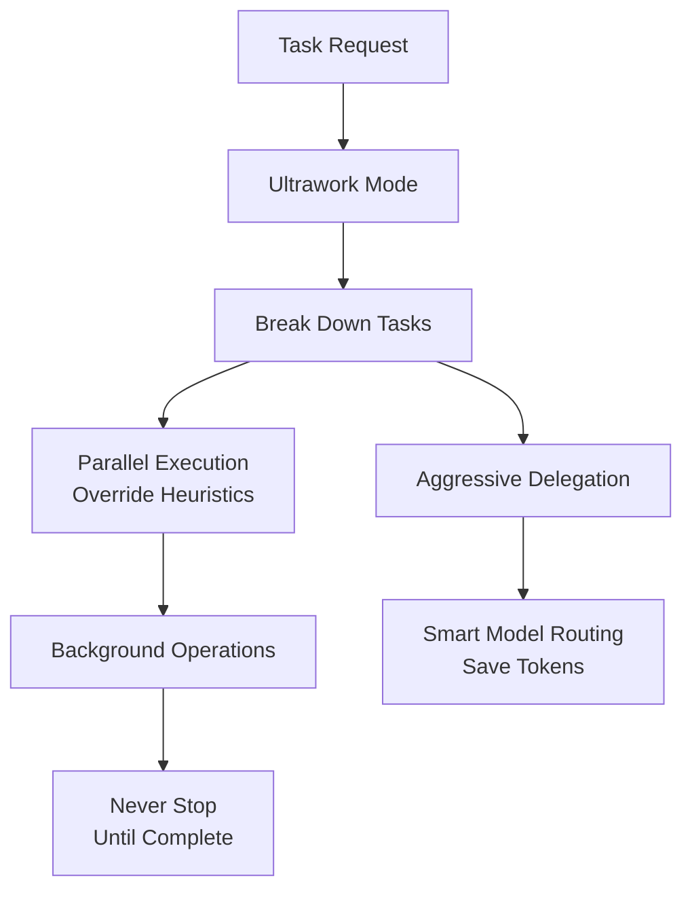

# Ultrawork Skill

Maximum performance mode with parallel agent orchestration for high-throughput task completion.

---

## Overview

| Property | Value |
|----------|-------|
| **Name** | ultrawork |
| **Type** | Enhancement skill (stackable) |
| **Purpose** | Maximum performance, parallel execution, aggressive delegation |

Ultrawork enhances Claude's capabilities by running multiple agents simultaneously for independent tasks, routing to specialist agents immediately, and using background operations for long-running work.



---

## What Ultrawork Activates

| Enhancement | Description |
|-------------|-------------|
| **Parallel Execution** | Run multiple agents simultaneously |
| **Aggressive Delegation** | Route tasks to specialists immediately |
| **Background Operations** | Use `run_in_background: true` heavily |
| **Persistence Enforcement** | Never stop until verified complete |
| **Smart Model Routing** | Use tiered agents to save tokens |

---

## Smart Model Routing (CRITICAL - SAVE TOKENS)

Choose tier based on task complexity:

```
LOW (haiku) → MEDIUM (sonnet) → HIGH (opus)
```

### Available Agents by Tier

| Domain | LOW (Haiku) | MEDIUM (Sonnet) | HIGH (Opus) |
|--------|-------------|-----------------|-------------|
| **Analysis** | oracle-low | oracle-medium | oracle |
| **Execution** | sisyphus-junior-low | sisyphus-junior | sisyphus-junior-high |
| **Search** | explore | explore-medium | - |
| **Research** | librarian-low | librarian | - |
| **Frontend** | frontend-engineer-low | frontend-engineer | frontend-engineer-high |
| **Docs** | document-writer | - | - |
| **Visual** | - | multimodal-looker | - |
| **Planning** | - | - | prometheus, momus, metis |

### Tier Selection Guide

| Task Complexity | Tier | Examples |
|-----------------|------|----------|
| **Simple lookups** | LOW | "What does this function return?", "Find where X is defined" |
| **Standard work** | MEDIUM | "Add error handling", "Implement this feature" |
| **Complex analysis** | HIGH | "Debug this race condition", "Refactor auth module" |

### Routing Examples

```
// Simple question → LOW tier (saves tokens!)
Task(subagent_type="oracle-low", prompt="What does this function return?")

// Standard implementation → MEDIUM tier
Task(subagent_type="sisyphus-junior", prompt="Add error handling to login")

// Complex refactoring → HIGH tier
Task(subagent_type="sisyphus-junior-high", prompt="Refactor auth module using JWT")

// Quick file lookup → LOW tier
Task(subagent_type="explore", prompt="Find where UserService is defined")

// Thorough search → MEDIUM tier
Task(subagent_type="explore-medium", prompt="Find all auth patterns in codebase")
```

---

## Background Execution Rules

### Run in Background

Set `run_in_background: true` for:

| Operation Type | Examples |
|----------------|----------|
| **Package installation** | npm install, pip install, cargo build |
| **Build processes** | npm run build, make, tsc |
| **Test suites** | npm test, pytest, cargo test |
| **Docker operations** | docker build, docker pull |

### Run Blocking

Run in foreground for:

| Operation Type | Examples |
|----------------|----------|
| **Quick status checks** | git status, ls, pwd |
| **File reads** | Read operations |
| **File edits** | Edit operations |
| **Simple commands** | Quick executions |

---

## Verification Checklist

Before stopping, verify:

| Criterion | Check |
|-----------|-------|
| [ ] **TODO LIST** | Zero pending/in_progress tasks |
| [ ] **FUNCTIONALITY** | All requested features work |
| [ ] **TESTS** | All tests pass (if applicable) |
| [ ] **ERRORS** | Zero unaddressed errors |

> **If ANY checkbox is unchecked, CONTINUE WORKING.**

---

## Ultrawork vs Default Mode

| Aspect | Default Mode | Ultrawork Mode |
|--------|--------------|----------------|
| **Parallelism** | Heuristic-based | **Parallel EVERYTHING** |
| **Delegation** | Selective | **Delegate even small tasks** |
| **Waiting** | Some waiting for results | **Never wait** |
| **Throughput** | Balanced efficiency | **Maximum** |

---

## Activation

### Slash Command

```
/ultrawork [task description]
```

### Magic Keywords

Include in your prompt:

- `ultrawork`
- `ulw`
- `uw`

### Example

```
ultrawork refactor the entire API layer

[Activates maximum parallelism, aggressive delegation,
background operations, and persistence]
```

---

## Stacking

Ultrawork stacks with other skills:

| Stack | Result |
|-------|--------|
| `sisyphus + ultrawork` | Multi-agent with maximum parallelism |
| `ultrawork + git-master` | High-throughput with atomic commits |
| `ultrawork + frontend-ui-ux` | Parallel UI/UX development |

---

## See Also

- [Sisyphus Skill](sisyphus.md) - Multi-agent orchestration
- [Git Master Skill](git-master.md) - Atomic commits
- [Skills Overview](overview.md) - All available skills
