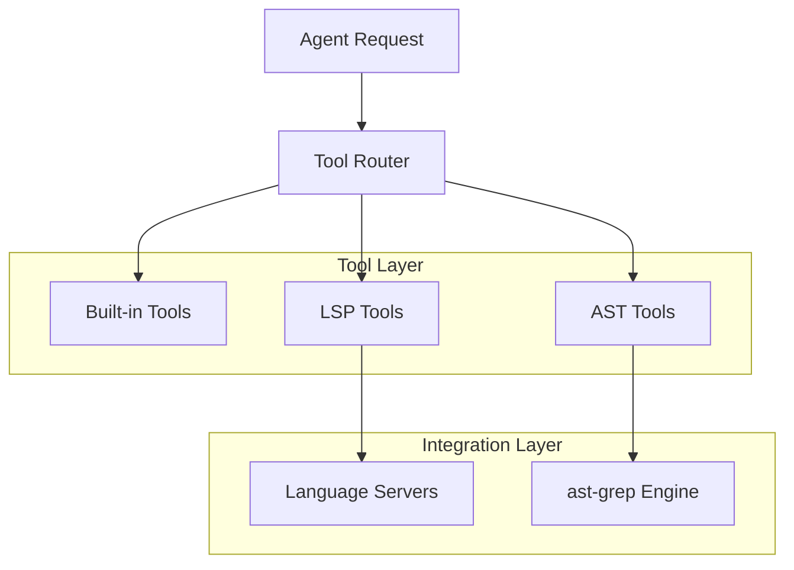
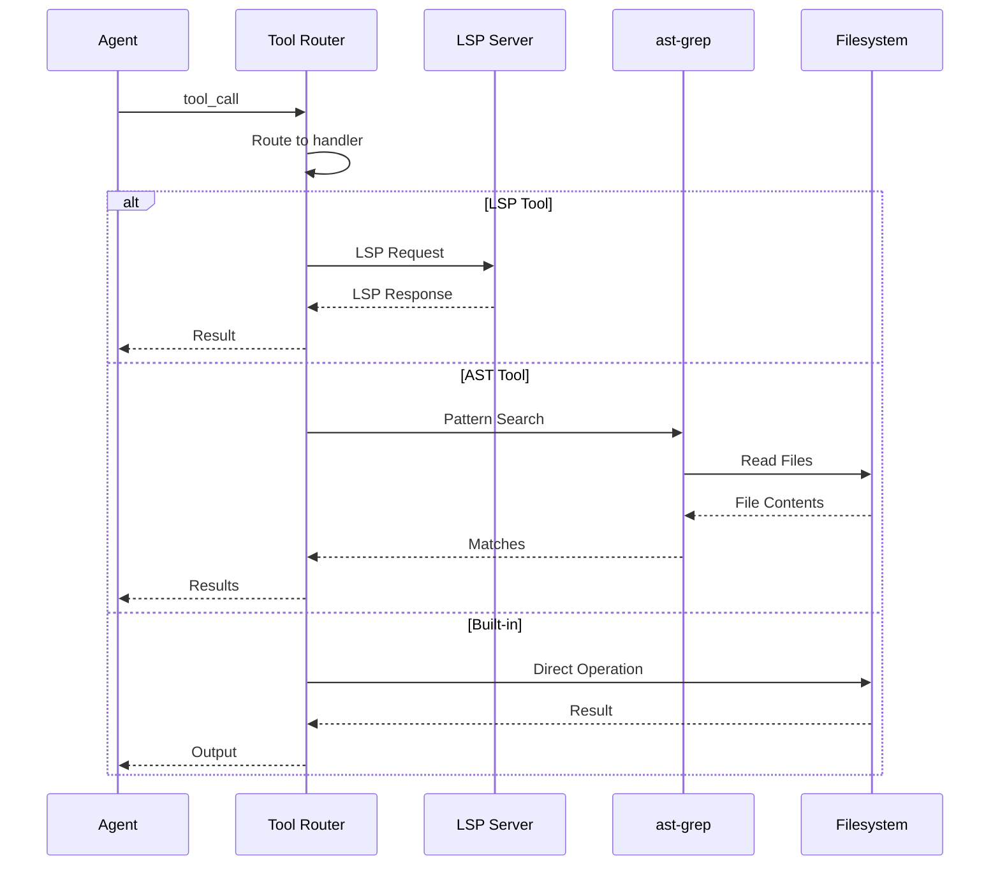

# Tool System Overview

> **Relevant source files**
> * [README.md](https://github.com/Yeachan-Heo/oh-my-claude-sisyphus/blob/main/README.md)
> * [.claude-plugin/plugin.json](https://github.com/Yeachan-Heo/oh-my-claude-sisyphus/blob/main/.claude-plugin/plugin.json)

oh-my-claude-sisyphus extends Claude Code's native tool ecosystem with LSP integration, AST-based code search, and enhanced built-in tools.

## Tool Categories

| Category | Description | Tools |
|----------|-------------|-------|
| **Built-in** | Native Claude Code tools | Read, Write, Edit, Bash, Glob, Grep, Task, TodoWrite, WebSearch, WebFetch |
| **LSP** | Language Server Protocol integration | hover, goto_definition, find_references, document_symbols, workspace_symbols, diagnostics, prepare_rename, rename, code_actions, code_action_resolve, lsp_servers |
| **AST** | Abstract Syntax Tree search | ast_grep_search, ast_grep_replace |

## Architecture



## Tool Permission Levels

| Permission | Description | Default for Edit Tools | Default for Read Tools |
|------------|-------------|------------------------|------------------------|
| `ask` | Prompt user for approval | Edit, Write | - |
| `allow` | Auto-approve without prompt | Read, Grep, Glob | Bash (with restrictions) |
| `deny` | Block tool usage | - | - |

### Permission Configuration

```json
{
  "toolPermissions": {
    "edit": "ask",
    "bash": "ask",
    "webfetch": "allow"
  }
}
```

## Built-in Tools

### File Operations

| Tool | Description | Permission |
|------|-------------|------------|
| `Read` | Read file contents | allow |
| `Write` | Create/overwrite file | ask |
| `Edit` | String replacement in file | ask |

### Search Tools

| Tool | Description | Permission |
|------|-------------|------------|
| `Glob` | Find files by pattern | allow |
| `Grep` | Search file contents | allow |

### Execution Tools

| Tool | Description | Permission |
|------|-------------|------------|
| `Bash` | Execute shell commands | ask |
| `Task` | Spawn subagent | allow |

### Organization Tools

| Tool | Description | Permission |
|------|-------------|------------|
| `TodoWrite` | Track task progress | allow |

### Web Tools

| Tool | Description | Permission |
|------|-------------|------------|
| `WebSearch` | Search the web | ask |
| `WebFetch` | Fetch web page | ask |

## LSP Tools

### Analysis Tools

| Tool | Description | LSP Method |
|------|-------------|------------|
| `lsp_hover` | Get type info and docs | `textDocument/hover` |
| `lsp_goto_definition` | Jump to symbol definition | `textDocument/definition` |
| `lsp_find_references` | Find all symbol usages | `textDocument/references` |
| `lsp_document_symbols` | Get file outline | `textDocument/documentSymbol` |
| `lsp_workspace_symbols` | Search symbols | `workspace/symbol` |
| `lsp_diagnostics` | Get errors/warnings | `textDocument/diagnostic` |
| `lsp_servers` | List available servers | - |

### Refactoring Tools

| Tool | Description | LSP Method |
|------|-------------|------------|
| `lsp_prepare_rename` | Validate rename operation | `textDocument/prepareRename` |
| `lsp_rename` | Rename symbol | `textDocument/rename` |
| `lsp_code_actions` | Get refactorings | `textDocument/codeAction` |
| `lsp_code_action_resolve` | Execute refactoring | `codeAction/resolve` |

## AST Tools

| Tool | Description | Engine |
|------|-------------|--------|
| `ast_grep_search` | Pattern-based AST search | ast-grep |
| `ast_grep_replace` | Pattern-based AST transform | ast-grep |

### Meta-Variables

| Variable | Matches | Example |
|----------|---------|---------|
| `$NAME` | Single node | `function $NAME($$$)` |
| `$$$` | Multiple nodes | `import $$$ from 'react'` |
| `$_` | Wildcard (any) | `const $_ = await $EXPR` |

## LSP Server Configuration

### Supported Servers

| Language | Server | Installation |
|----------|--------|--------------|
| TypeScript | `typescript-language-server` | `npm install -g typescript-language-server` |
| Python | `pylsp` | `pip install python-lsp-server` |
| Rust | `rust-analyzer` | Included with rustup |
| Go | `gopls` | `go install golang.org/x/tools/gopls` |
| Java | `jdtls` | Eclipse JDT Language Server |

### Configuration Format

```json
{
  "lsp": {
    "typescript-language-server": {
      "command": ["typescript-language-server", "--stdio"],
      "extensions": [".ts", ".tsx"],
      "priority": 10
    }
  }
}
```

## Tool Execution Flow



## Tool Naming Conventions

| Convention | Examples | Description |
|------------|----------|-------------|
| `lsp_*` | `lsp_hover`, `lsp_rename` | LSP protocol tools |
| `ast_grep_*` | `ast_grep_search` | ast-grep tools |
| PascalCase | `Read`, `Write`, `Edit` | Built-in tools |

## Error Handling

| Error Type | Handling |
|------------|----------|
| LSP server not running | Graceful degradation to built-in tools |
| Parse error (AST) | Return error with file location |
| File not found | Return error without crashing |
| Timeout | Return partial results with warning |

## Further Reading

- [LSP Tools](lsp-tools.md) - Detailed LSP operations reference
- [AST Tools](ast-tools.md) - Pattern-based code search and transform
- [Built-in Tools](built-in-tools.md) - Native Claude Code tools reference
